# Installing Splunk

These instructions are for installing Splunk on a single system.

## Summary

This walkthrough involves installing Splunk on your Windows victim machine. As previously mentioned, there are data ingestion limitations with the free Splunk instances. To overcome those issues we will install Splunk on the victim VM only and keep data ingestion disabled until we are ready to run our attack. After we run the attack, we will disable ingestion of logs into Splunk. 

## Exercise Setup

1. Download the tuned Sysmon Configuration File

[Sysmon Configure](./Files/m122sysmon.xml)

1. Signup for a free Splunk account at this link. You may need a business email (not gmail, yahoo, etc). If you cannot get a free Splunk account, the third alternative is a TryHackMe room (the walkthrough for the TryHackMe room will be provided later).

    

[Free Splunk Trial | Download Splunk Enterprise Free for 60 Days | Splunk](https://www.splunk.com/en_us/download/splunk-enterprise.html)

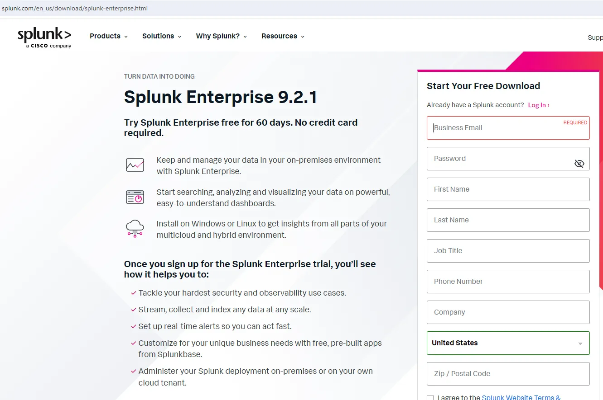

## Set Up Splunk

After you have created an account, from your Windows victim VM login, choose your download by selecting the Windows tab.

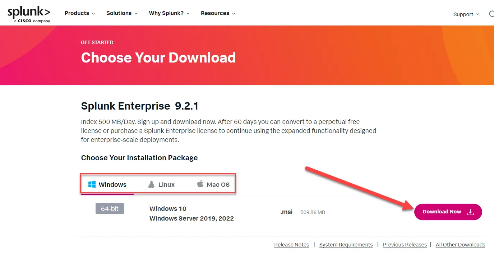

Accept the terms of agreement.

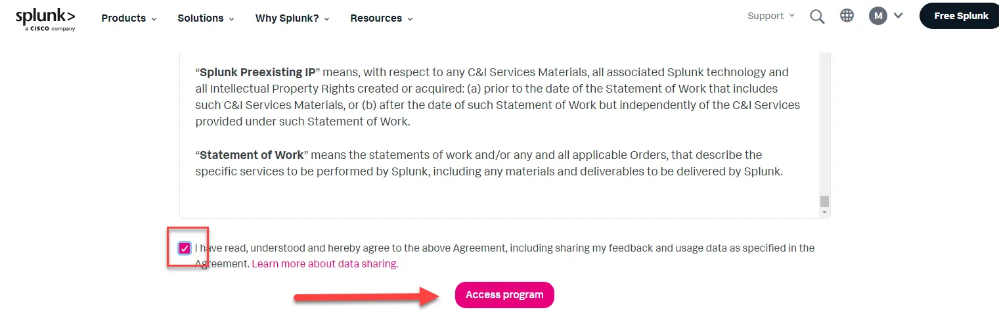

The download should automatically begin. Navigate to the directory you downloaded the file and simply double click the .msi file.

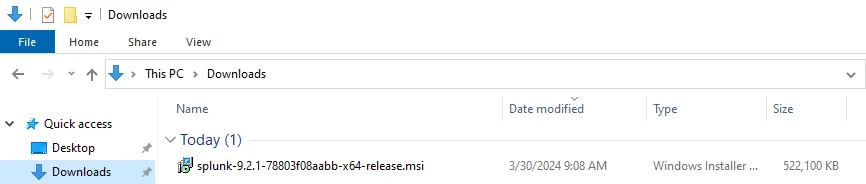

Select run.

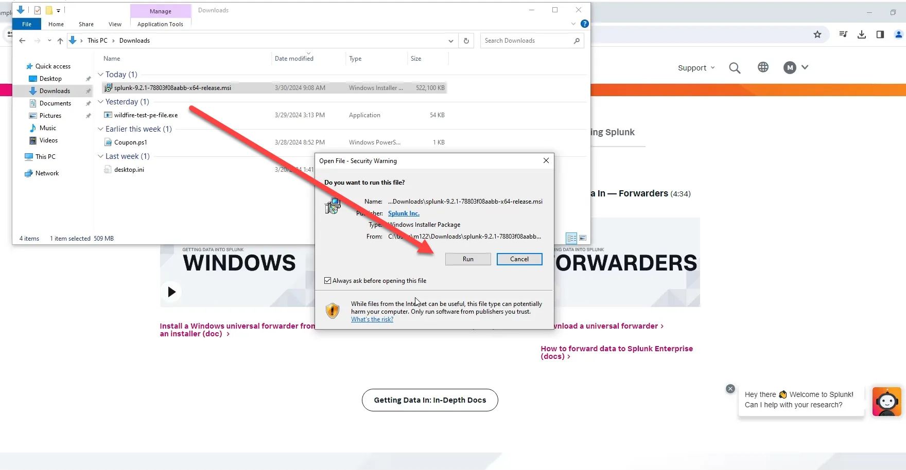

Accept license agreement.

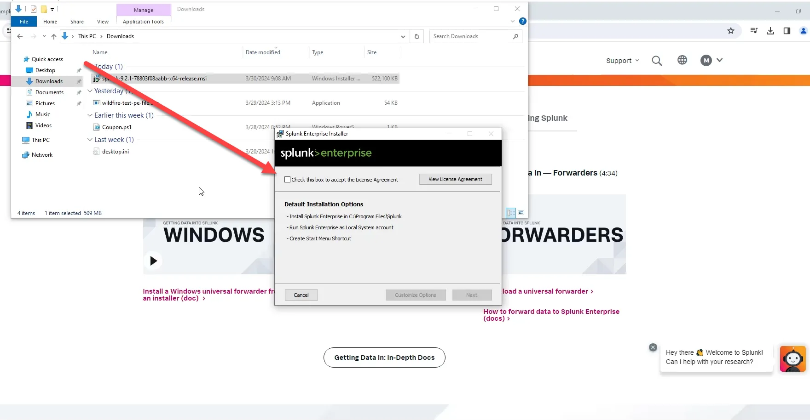

Provide username and password.

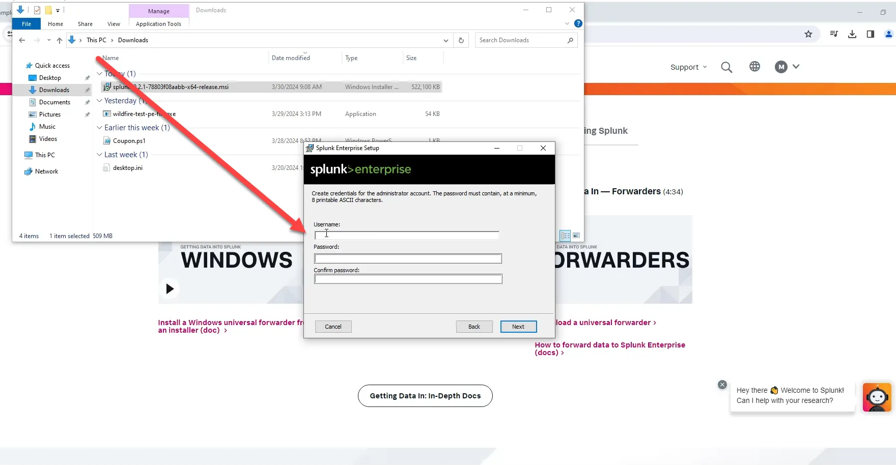

When completed launch Splunk.

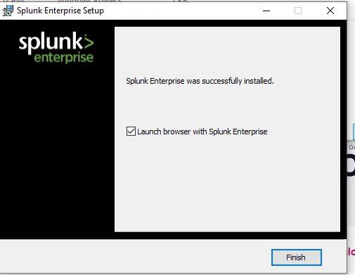

If Splunk does not open up in the browser automatically, type the URL below and login with the credentials you created.

```powershell
localhost:8000
```

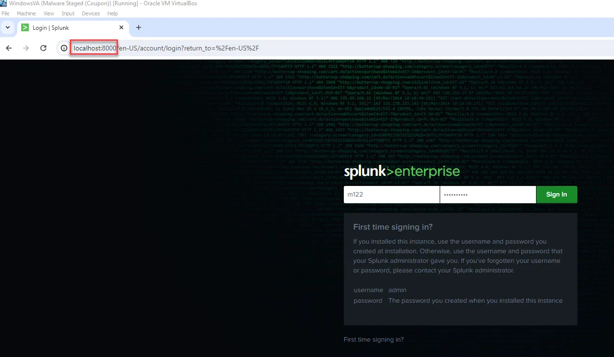

## Add Splunk Apps

Select the Apps dropdown and select “Find More Apps”

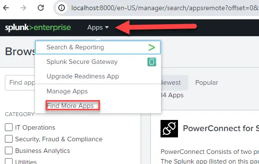

Search for Sysmon and install the Splunk Add-on for Sysmon.

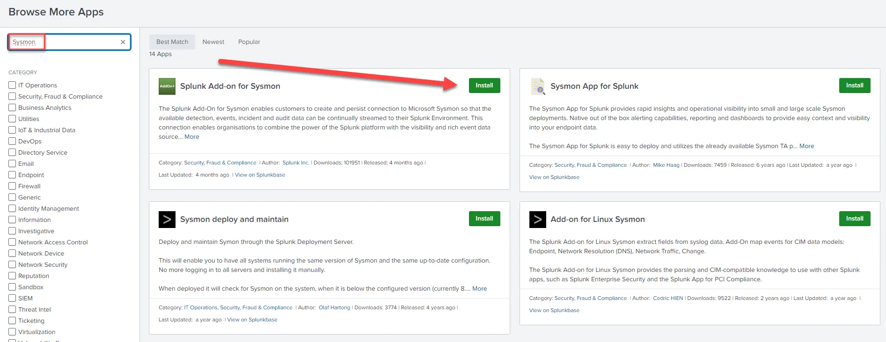

You will be asked to login with the creds for your Splunk account. This is the account you set up when you downloaded Splunk, not the account you set up to access your instance of Splunk.

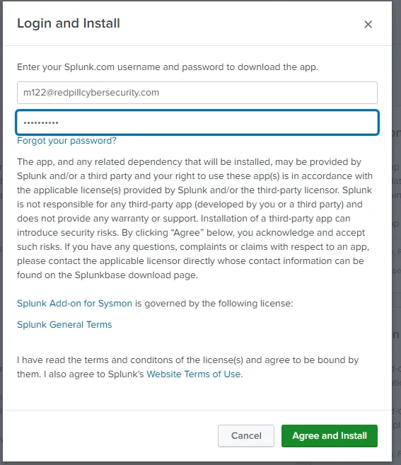

After successfully logging in, the installation will be automatically completed and you will be presented with the box seen below. Select “Go Home”.

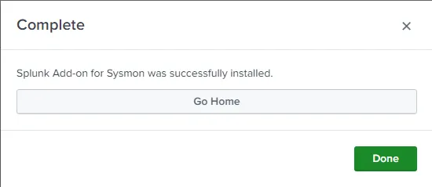

We will install more apps later in the course. For now, move on to the next section.

## Set Up Data Inputs

Select the Settings dropdown and the select “Data inputs” from the Data section.

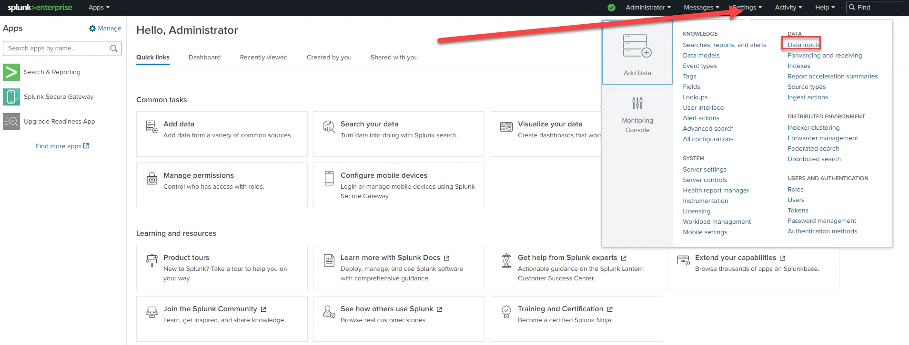

Then select “Remote event log collections”.

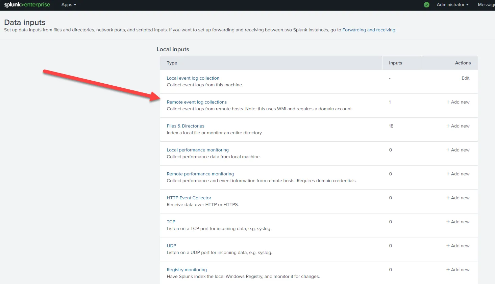

Enable “Microsoft-Windows-Sysmon/Operational, WEC-Sysmon”

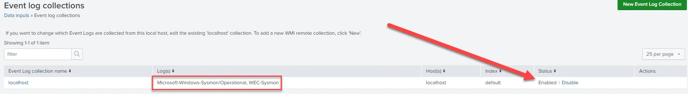

This is also the same way you will disable collection after you run the attack to ensure you do not surpass the data limitations with Splunk. 

## Change Sysmon Configuration

Place the downloaded tuned Sysmon configuration (m122sysmon.xml) in the Sysmon directory found in ProgramData. The reason we had to tune the Sysmon configuration is because Splunk creates a lot of noise. So we “excluded” most of the Splunk events in the configuration.  If you are interested in how Sysmon was tuned see the Appendix below.

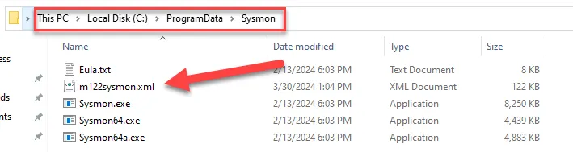

Restart Sysmon with the new configuration file by using the following command launched as administrator inside the Sysmon directory.

```powershell
Sysmon -c m122sysmon.xml
```

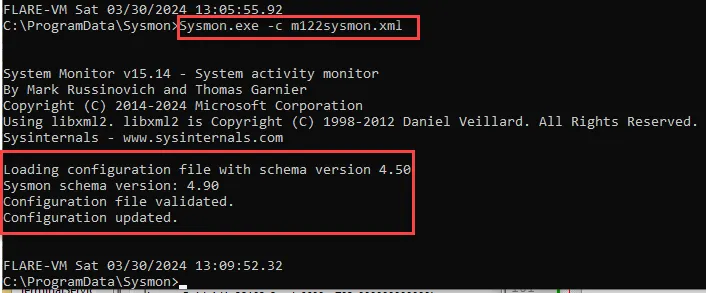

## Test the setup

On your Windows VM open PowerShell and type the commands below.

whoami

ipconfig

Go to Search & Reporting (Click the Splunk>Enterprise icon in the upper left to present the home page)

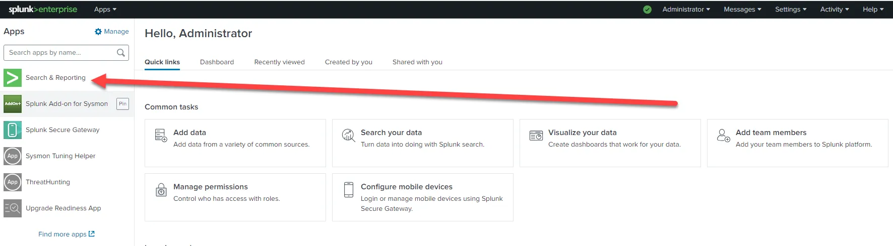

Run the query below

```powershell
EventID=1 parent_process_name=powershell.exe OriginalFileName=ipconfig.exe OR whoami.exe
```

You should receive results multiple hits.

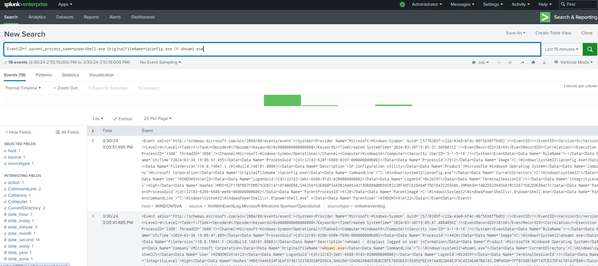

If so your set up is working and you are ready for the next exercise.

## Disable Data Ingestion

Disable data ingestion the same way you enabled it. We will enable it when we run the next exercise.

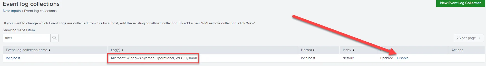

# Appendix: Tuning Sysmon

## Tune Sysmon (If you changed the Sysmon Configuration earlier, you do not have to do this part. This is how the downloaded configuration file was tuned.)

Originally there were a large number of events in a relatively short amount of time. Most of those were being created by Splunk. I tuned our Sysmon configuration file to exclude the Splunk and other noise generating events. 

Navigate to C:\ProgramData and open the Sysmon configuration file with notepad++ (or notepad).

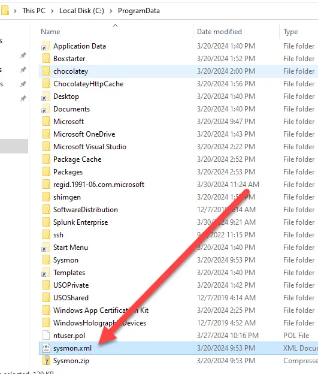

Scroll down under SYSMON EVENT ID 1 to the “exclude” section. We will add lines to exclude Splunk in the “Image condition”. 

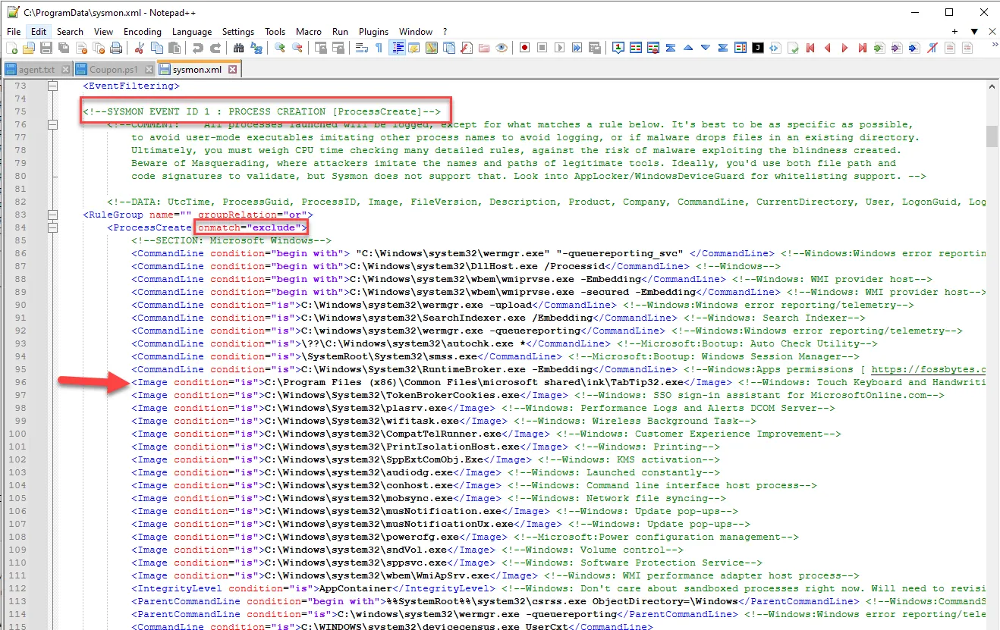

Add the following lines ensuring the line spacing is consistent.

```powershell
<Image condition="is">C:\Program Files\Splunk\bin\btool.exe</Image> <!--Splunk-->
<Image condition="is">C:\Program Files\Splunk\bin\splunkd.exe</Image> <!--Splunk-->
<Image condition="is">C:\Program Files\Splunk\bin\splunk-optimize.exe</Image> <!--Splunk-->
<Image condition="is">C:\Program Files\Splunk\bin\python3.exe</Image> <!--Splunk-->
<Image condition="is">C:\Program Files\Splunk\bin\splunk-winevtlog.exe</Image> <!--Splunk-->
<Image condition="is">C:\Program Files\Splunk\bin\splunk-regmon.exe</Image> <!--Splunk-->
<Image condition="is">C:\Program Files\Splunk\bin\splunk-netmon.exe</Image> <!--Splunk-->
<Image condition="is">C:\Program Files\Splunk\bin\splunk-powershell.exe</Image> <!--Splunk-->
<Image condition="is">C:\Program Files\Splunk\bin\splunk-admon.exe</Image> <!--Splunk-->
<Image condition="is">C:\Program Files\Splunk\bin\splunk-MonitorNoHandle.exe</Image> <!--Splunk-->
<Image condition="is">C:\Program Files\Splunk\bin\splunk.exe</Image> <!--Splunk-->
<Image condition="is">C:\Program Files (x86)\Google\Update\GoogleUpdate.exe</Image> <!--Google noise-->
<Image condition="is">C:\Windows\WinSxS\amd64_microsoft-windows-servicingstack_31bf3856ad364e35_10.0.19041.1940_none_7dd80d767cb5c7b0\TiWorker.exe</Image> <!--TrustedInstaller-->
<Image condition="is">C:\Windows\servicing\TrustedInstaller.exe</Image> <!--Trusted installer-->
<Image condition="is">C:\Windows\System32\MoUsoCoreWorker.exe</Image> <!--Trusted installer-->
<Image condition="is">C:\Windows\System32\VSSVC.exe</Image> <!--VolumeShadow-->
<Image condition="is">C:\Program Files (x86)\Google\Update\1.3.36.372\GoogleCrashHandler64.exe</Image> <!--GoogleNoise-->
<Image condition="is">C:\Program Files (x86)\Google\Update\1.3.36.372\GoogleCrashHandler.exe</Image> <!--GoogleNoise-->
<Image condition="is">C:\Program Files (x86)\Microsoft\EdgeUpdate\MicrosoftEdgeUpdate.exe</Image> <!--EdgeNoise-->

```

Then scroll down to EventCode 22 and add the following exclude lines.

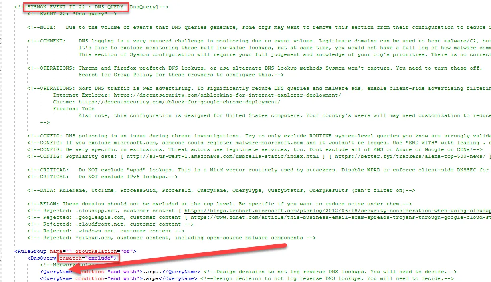

```powershell
<QueryName condition="end with">.splunk.com</QueryName> <!--Splunk noise-->
```

To avoid confusion, rename the sysmon configuration file. Place the saved version of the Sysmon configuration in the Sysmon directory found in ProgramData.


Restart Sysmon with the new configuration file by using the following command launched as administrator inside the Sysmon directory.

```powershell
Sysmon -c m122sysmon.xml
```


You can test your configuration by going to Event Viewer and navigating to Sysmon Operational and clearing the logs. Once the logs have been cleared, wait a few minutes and refresh the logs. There should be significantly less events.