# Basic Splunk SPL

### **Summary**

This walkthrough provides an intro to Splunk and examples of basic Splunk SPL (Search Processing Language) and operators. 

### **Background**

Splunk is a powerful platform for searching, monitoring, and analyzing machine-generated data, often in real-time. It transforms raw data into meaningful insights through its ability to index and correlate large amounts of information across various systems. In cybersecurity, Splunk is widely used for security information and event management (SIEM) purposes. It helps organizations detect threats, monitor networks, investigate incidents, and maintain compliance by collecting and analyzing logs from various sources like firewalls, servers, endpoints, and applications.

Splunk’s advanced analytics capabilities enable security teams to perform threat hunting, anomaly detection, and forensic analysis. Its customizable dashboards, real-time alerts, and reporting features allow security professionals to gain deep visibility into network activities, detect potential attacks early, and respond swiftly to cyber threats. Additionally, with its integrations into security orchestration, automation, and response (SOAR) solutions, Splunk helps automate the response to incidents, reducing the time spent on manual investigation.

### Exercise Setup:

Download the Sysmon logs from this link:

[Microsoft-Windows-Sysmon-Operational.evtx](Files/Microsoft-Windows-Sysmon-Operational.evtx)

Import the logs into Splunk. 

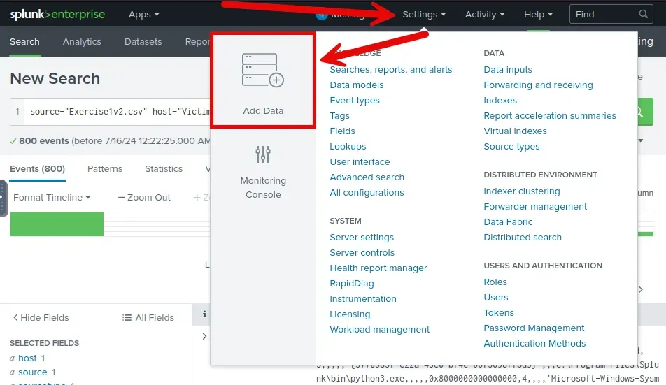

Select Monitor.

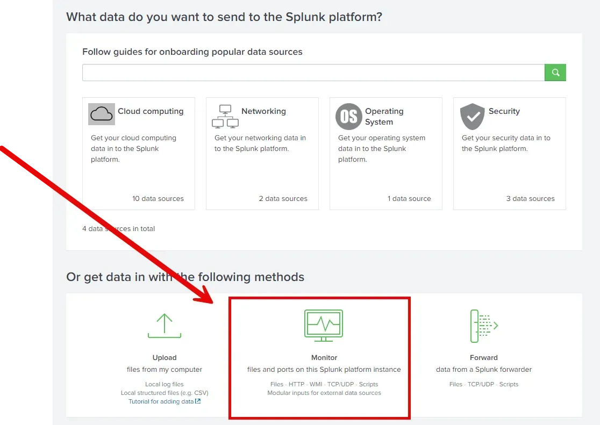

Select Files and Directories.

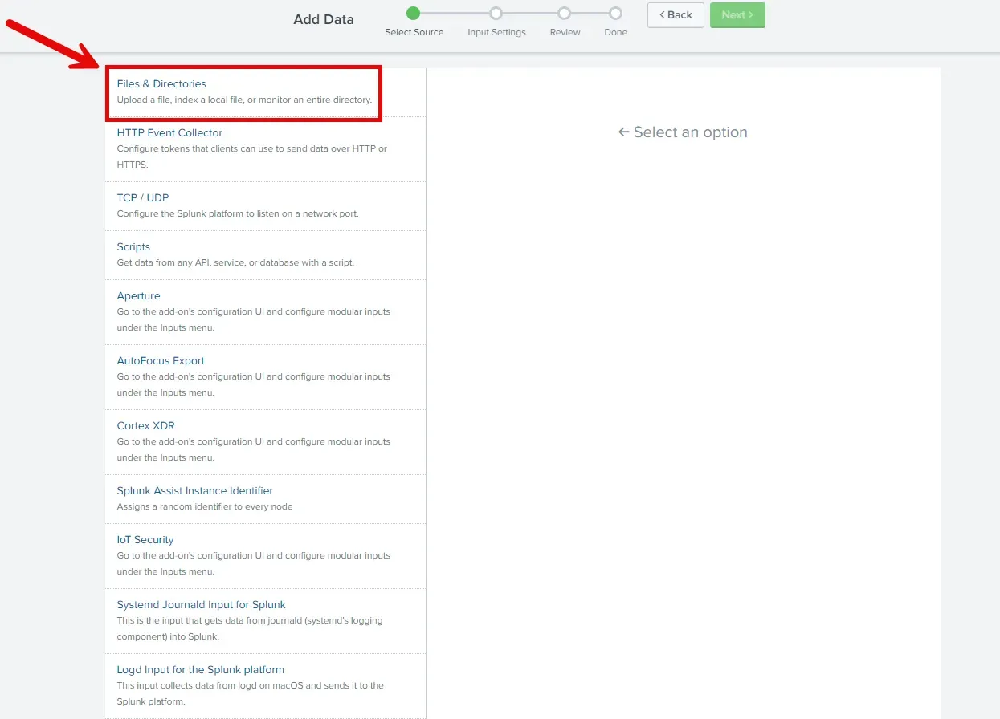

Browse to the directory.

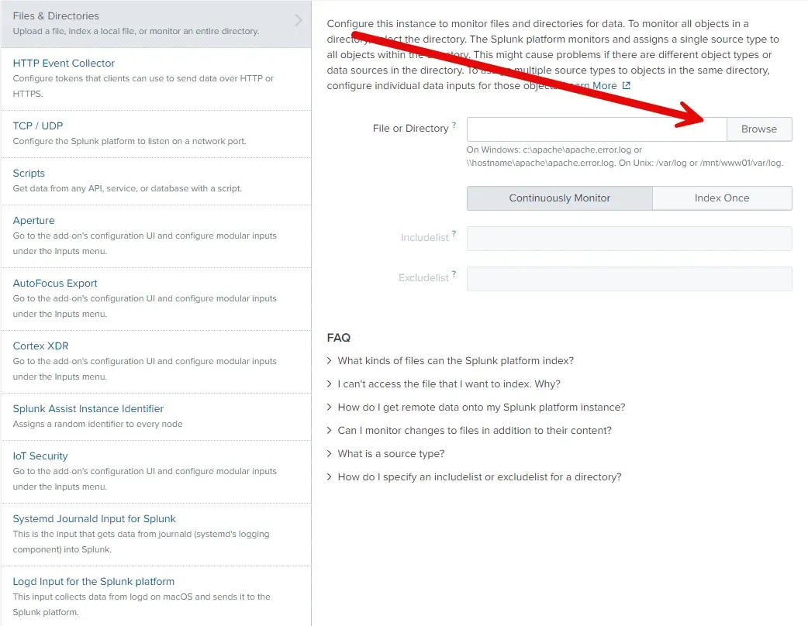

Select the Sysmon logs.

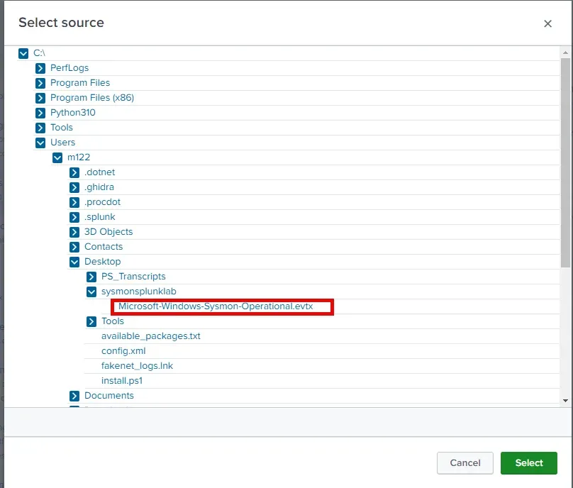

Select “Next” and change the index name to “sysmonsplunklab”

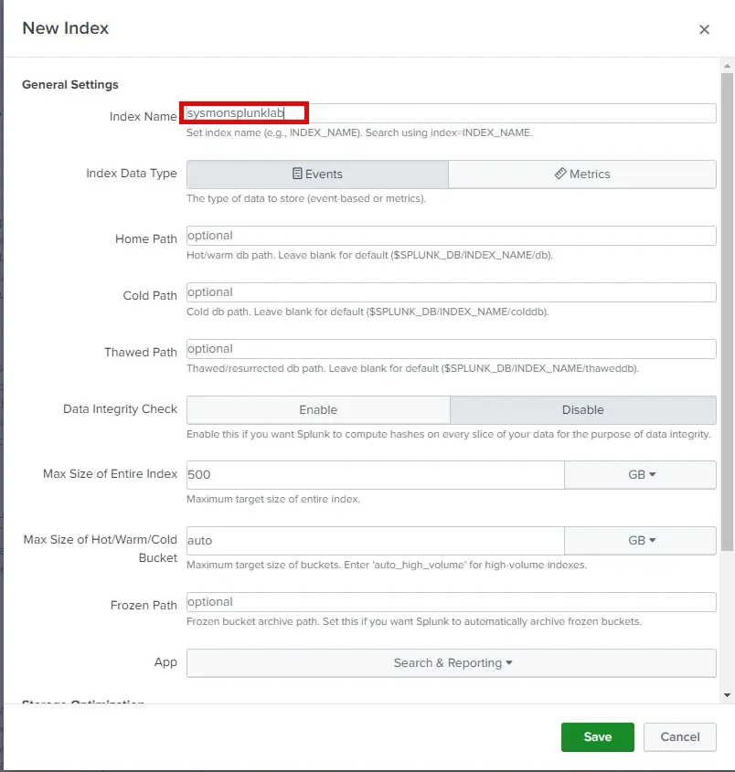

Select “Start Searching”

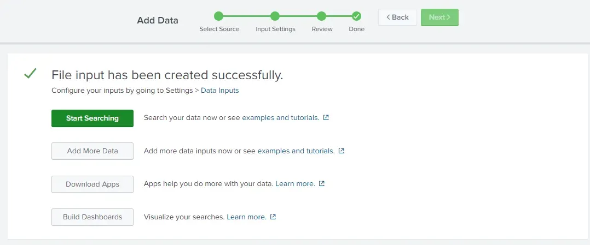

At first, there will be no events.

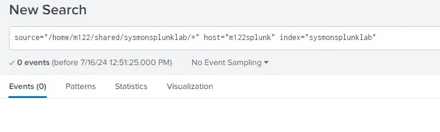

Delete everything from the search window except “index=”sysmonsplunklab”

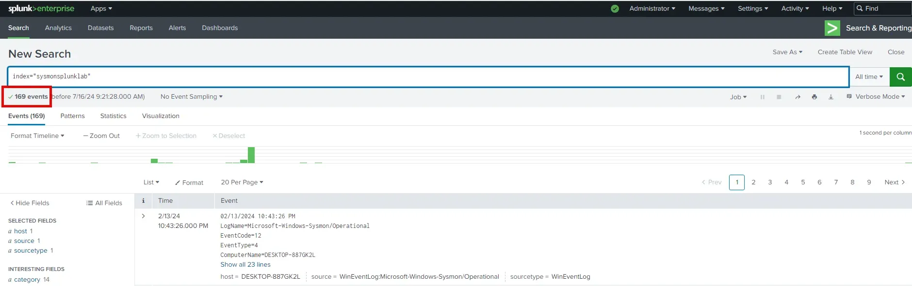

Change the Time Zone in Splunk to GMT.

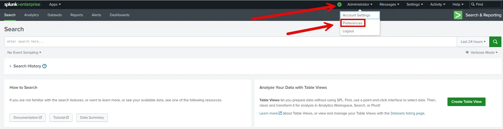

Select GMT.

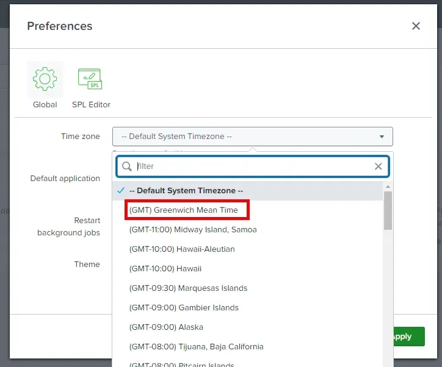

You are now ready to begin the exercise.

### **Splunk Components**

**The Splunk Forwarder** is a lightweight agent installed on monitored endpoints, designed primarily to collect and forward data to a Splunk instance. It operates with minimal resource usage, ensuring it doesn't impact the performance of the endpoint. Key data sources include:

- Web servers generating web traffic.
- Windows machines producing Windows Event Logs, PowerShell, and Sysmon data.
- Linux hosts generating system logs.
- Databases generating connection requests, responses, and error logs.

**The Splunk Indexer** is essential for processing data received from forwarders. It normalizes the data into field-value pairs, identifies data types, and stores them as events. This processed data is then optimized for efficient searching and analysis.

**The Splunk Search Head** is the interface within the Search & Reporting App where users can query indexed logs, as shown below. When a user performs a search or utilizes the Splunk Search Processing Language (SPL), the query is sent to the indexer, which returns the relevant events as field-value pairs.

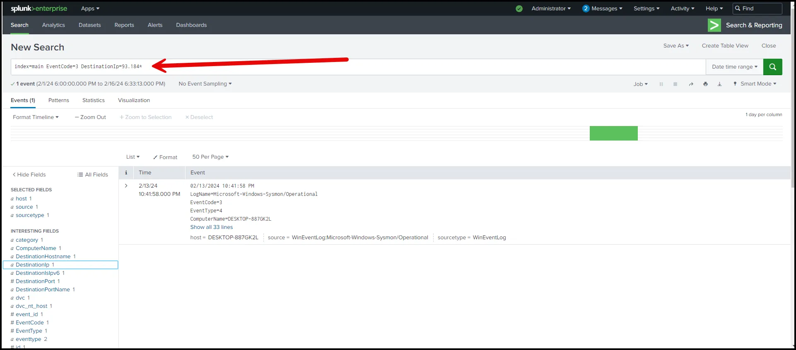

### SPL

Splunk's Search Processing Language (SPL) is a powerful query language used to search, filter, and analyze data within Splunk. It enables users to interact with indexed data, applying search commands, functions, and operators to retrieve meaningful insights. SPL allows for complex data manipulation, such as filtering results, performing calculations, creating reports, and generating visualizations. Its flexibility and wide range of commands make it essential for working with Splunk’s vast datasets, providing a structured way to extract actionable information from logs and events.

### **Search Field Operators**

Splunk field operators serve as the fundamental components for constructing search queries. They allow you to filter, exclude, and refine search results based on specified criteria. Common field operators include comparison operators, wildcards, and Boolean operators.

**Comparison Operators**

These operators are used to compare values with fields. Below are some common comparison operators:

| **Field Name** | **Operator** | **Example** | **Explanation** |
| --- | --- | --- | --- |
| **Equal** | = | UserName=Mark | This operator is used to match values against the field. In this example, it will look for all the events, where the value of the field UserName is equal to Mark. |
| **Not Equal to** | != | UserName!=Mark | This operator returns all the events where the UserName value does not match Mark. |
| **Less than** | < | Age < 10 | Showing all the events with the value of Age less than 10. |
| **Less than or Equal to** | <= | Age <= 10 | Showing all the events with the value of Age less than or equal to 10. |
| **Greater than** | > | Outbound_traffic > 50 MB | This will return all the events where the Outbound traffic value is over 50 MB. |
| **Greater Than or Equal to** | >= | Outbound_traffic >= 50 MB | This will return all the events where the Outbound traffic value is greater or equal to 50 MB. |

To demonstrate, do a query for any EventCode

```go
index=main EventCode=*
```

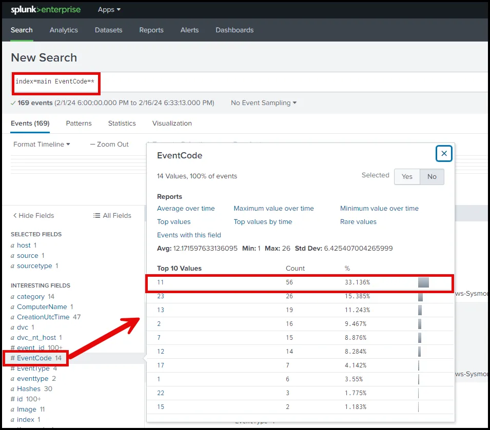

Now use the comparison operator to display all Event Codes except EventCode 11

**Search Query:** 

```go
index=main EventCode!=11
```

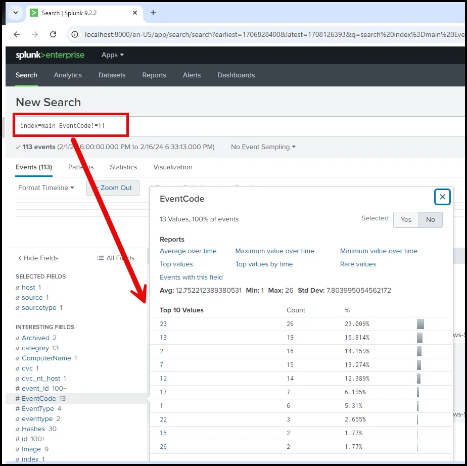

As seen above, the result was all the Event Codes except EventCode 11.

**Boolean Operators**

Splunk supports the following Boolean operators, which are useful for searching, filtering, and refining results.

| **Operator** | **Syntax** | **Explanation** |
| --- | --- | --- |
| **NOT** | field_A **NOT** value | Ignore the events from the result where field_A contain the specified value. |
| **OR** | field_A=value1 **OR** field_A=value2 | Return all the events in which field_A contains either value1 or value2. |
| **AND** | field_A=value1 **AND** field_B=value2 | Return all the events in which field_A contains value1 and field_B contains value2. |

To understand how boolean operator works in SPL, we can add the condition to show EventCode 1

**Search Query:** 

```go
index=main EventCode!=11 AND EventCode=1
```

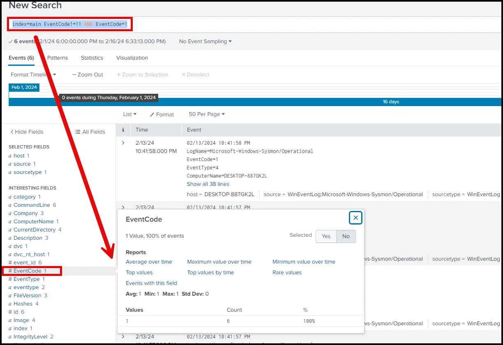

**Wild Card**

Splunk supports wildcards to match the characters in the strings.

| **Wildcard symbol** | **Example** | **Explanation** |
| --- | --- | --- |
| ***** | status=fail* | It will return all the results with values like
status=failed
status=failure |

We can use the wildcard to show all Destination IPs (dest_ip) ****that start with “93.184”

**Search Query:** 

```go
index=main EventCode=3 DestinationIp=93.184*
```

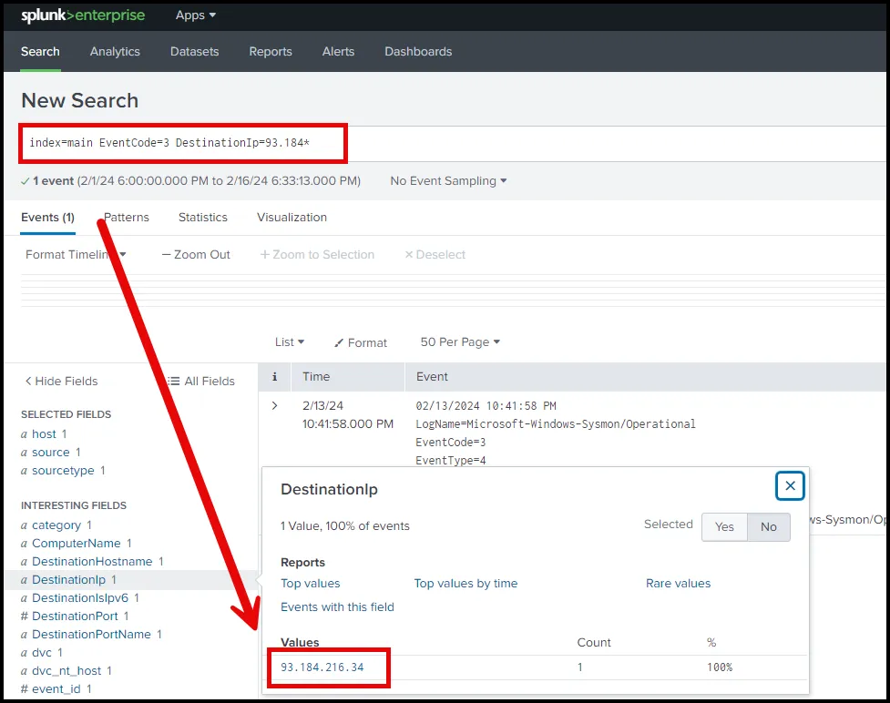

### **Filtering Results in SPL**

Networks can generate thousands of logs per minute, all of which are ingested into Splunk. Without using filters, searching for anomalies can be overwhelming. SPL allows us to apply filters to narrow down the results, displaying only the relevant events of interest. Filters enable us to include or exclude specific data from the results. The following commands are useful for applying filters to search results.

**Search**

| **Command** | **search** |
| --- | --- |
| **Explanation** | This command is used to search for the raw text while using the chaining command **`|`** |
| **Syntax** | | search  <search_keyword> |
| **Example** | | **`search Preventivo*`** use the search command to show all the events containing the term Preventivo*. This will return all the events that contain the term "Preventivoindex=main *
| search Preventivo*". |

**Search Query:**

```go
index=main *
| search Preventivo*
```

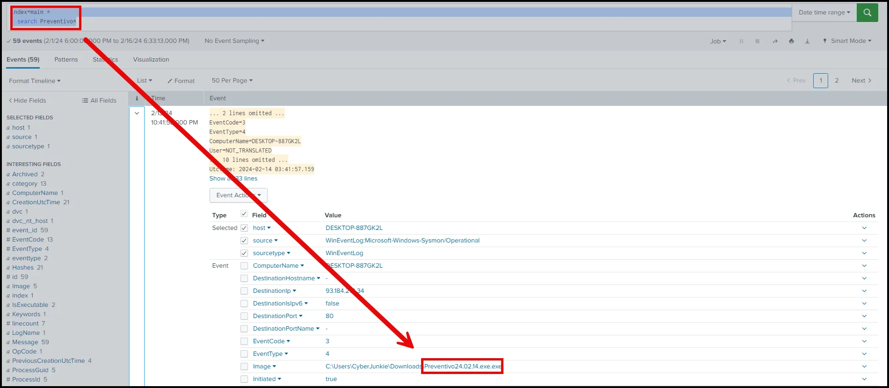

**Dedup**

| **Command** | **dedup** |
| --- | --- |
| **Explanation** | Dedup is the command used to remove duplicate fields from the search results. We often get the results with various fields getting the same results. These commands remove the duplicates to show the unique values. |
| **Syntax** | | dedup <fieldname> |
| **Example** | | **`dedup ProcessID`** |

We can use the dedup command to show the list of unique ProcessIDs.

**Search Query:** 

```go
index=main *
| table ProcessId, host
| dedup ProcessId
```

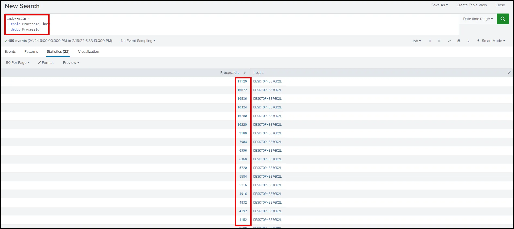

**Rename**

| **Command** | **rename** |
| --- | --- |
| **Explanation** | It allows us to change the name of the field in the search results. It is useful in a scenario when the field name is generic or log, or it needs to be updated in the output. |
| **Syntax** | | rename  <fieldname> |
| **Example** | | **`rename QueryName as Domain`** |

Let's rename the User field to Employees using the following search query.

**Search Query**:

```go
index=main EventCode=22
| table _time, host, QueryName
| dedup QueryName
| rename QueryName as Domain
```

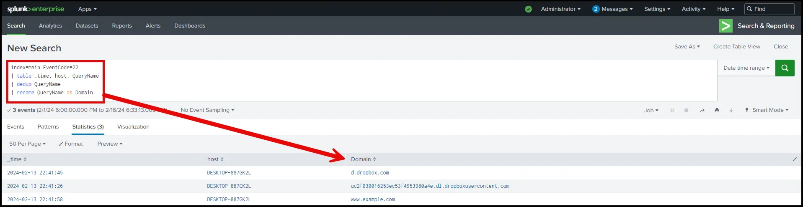

### SPL Structuring the Search Results

**Table**

| **Explanation** | Each event has multiple fields, and not every field is important to display. The Table command allows us to create a table with selective fields as columns. |
| --- | --- |
| **Syntax** | | table <field_name1> <fieldname_2> |
| **Example** | | **`table`**

| **`head 20`** # will return the top 20 events from the result list. |

This search query will create a table with three columns selected and ignore all the remaining columns from the display.

**Search Query:**

```go
index=main EventCode=3
| table _time, host, SourceIp, DestinationIp
```

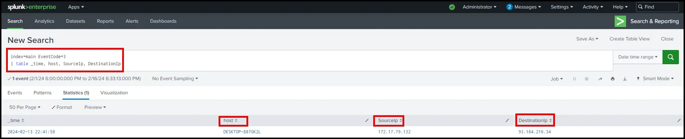

# Head

| **Explanation** | The **head** command returns the first 10 events if no number is specified. |
| --- | --- |
| **Syntax** | | head <number> |
| **Example** | | **`head`**   # will return the top 10 events from the result list
| **`head 20`**    # will return the top 20 events from the result list |

The following search query will show the table containing the mentioned fields and display only the top 5 entries.

**Search Query:**

```go
index=main EventCode=11
| table _time, host, TargetFilename, User
| head 5
```

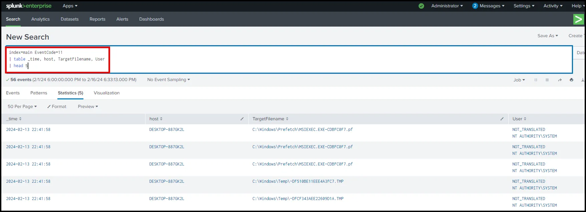

# Tail

| **Explanation** | The **Tail** command returns the last 10 events if no number is specified. |
| --- | --- |
| **Syntax** | | tail <number> |
| **Example** | | **`tail`** # will return the last 10 events from the result list| **`tail 20`**   # will return the last 20 events from the result list |

The following search query will show the table containing the mentioned fields and display only 5 entries from the bottom of the list.

**Search Query:**

```go
index=main EventCode=11
| table _time, host, TargetFilename, User
| tail 5
```

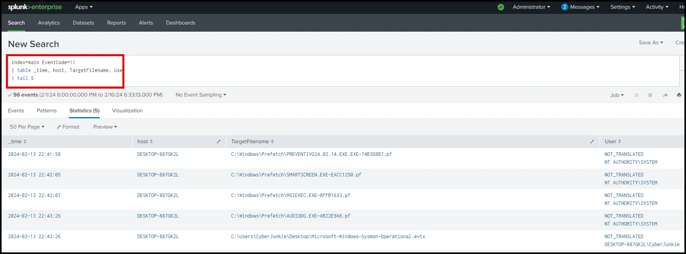

## Sort

| **Explanation** | The **Sort** command allows us to order the fields in ascending or descending order. |
| --- | --- |
| **Syntax** | | **`sort`** <field_name> |
| **Example** | | **`sort TargetFilename`** # This will sort the result in Ascending order. |

The following search query will ****sort the results based on the Hostname field.

**Search Query:**

```go
index=main EventCode=11
| table _time, host, TargetFilename, User
| sort TargetFilename
```

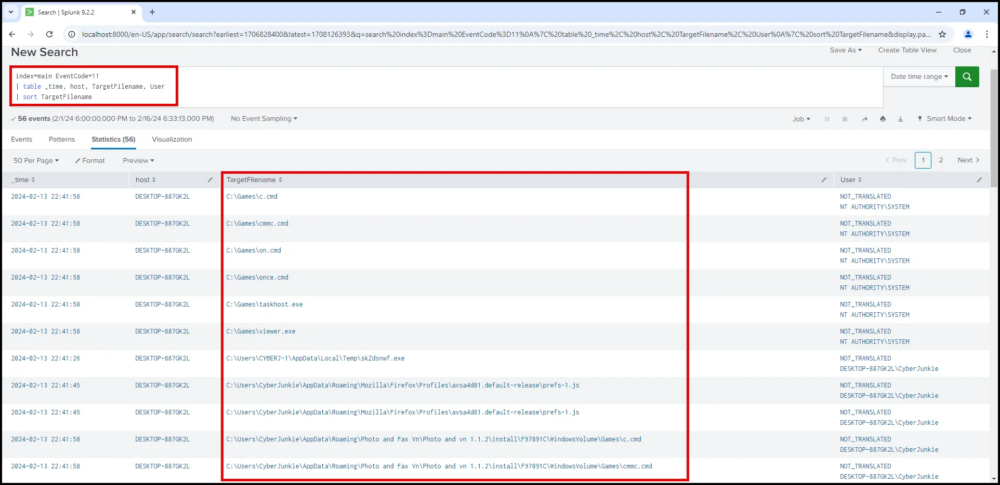

### Reverse

| **Explanation** | The reverse command simply reverses the order of the events. |
| --- | --- |
| **Syntax** | |  reverse |
| **Example** | **`<Search Query> | reverse`** |

**Search Query:**

```go
index=main EventCode=11
| table _time, host, TargetFilename, User
| reverse
```

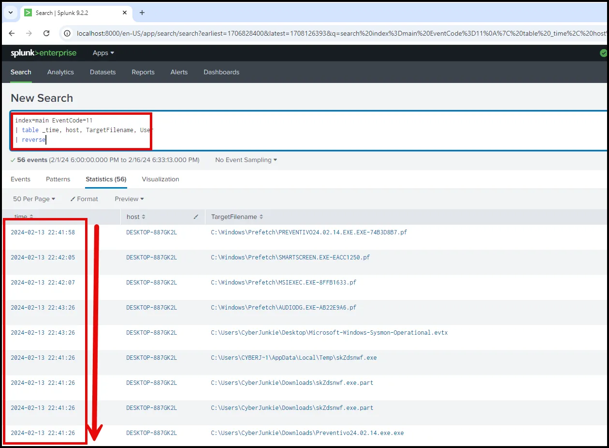

### Transformational Commands in SPL

**General Transformational Commands**

**Top**

| **Command** | **top** |
| --- | --- |
| **Explanation** | This command returns frequent values for the top 10 events. |
| **Syntax** | | top  <field_name>
| top limit=6 <field_name> |
| **Example** | **`top limit=3 TargetFilename`** |

The following command will display the top 7 Image ( representing Processes) captured.

**Search Query:**

```go
 index=main EventCode=11
| top limit=3 TargetFilename
```

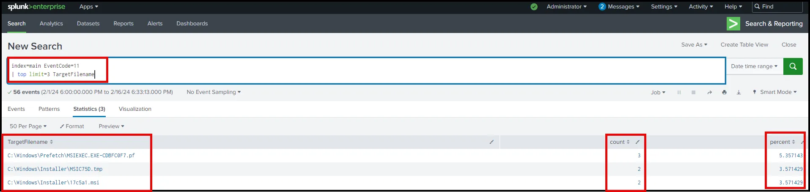

**Rare**

| **Command** | **rare** |
| --- | --- |
| **Explanation** | This command does the opposite of top command as it returns the least frequent values or bottom 10 results. |
| **Syntax** | | rare <field_name>
| rare limit=6 <field_name> |
| **Example** | **`rare limit=3 TargetFilename`** |

The following command will display the rare 3 TargetFilenames captured.

**Search Query:**

```
index=main EventCode=11
| rare limit=3 TargetFilename
```

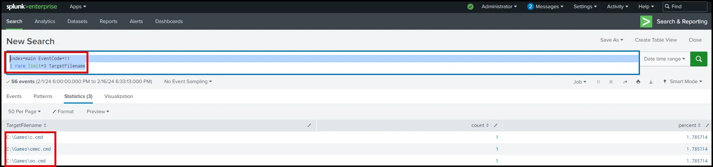

**Splunk Chart Commands**

These are very important types of transforming commands that are used to present the data in table or visualization form. Most of the chart commands utilize various stat commands.

# Chart

| **Command** | **chart** |
| --- | --- |
| **Explanation** | The chart command is used to transform the data into tables or visualizations. |
| **Syntax** | | chart <function> |
| **Example** | | **`chart count by Image`** |

**Search Query:** 

```go
index=main EventCode=11
| chart count by TargetFilename
```

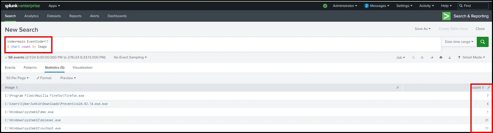

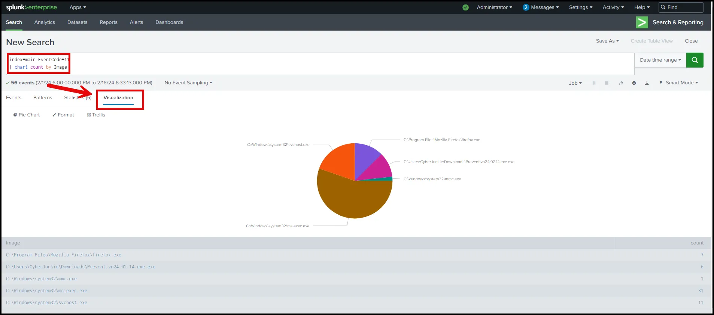

### Timechart

| **Command** | **timechart** |
| --- | --- |
| **Explanation** | The timechart command returns the time series chart covering the field following the function mentioned. Often combined with STATS commands. |
| **Syntax** | | timechart function  <field_name> |
| **Example** | | **`timechart count by host`** |

The following query will display the Image chart based on the time.

**Search Query:**

```
index=main | timechart count by Image
```

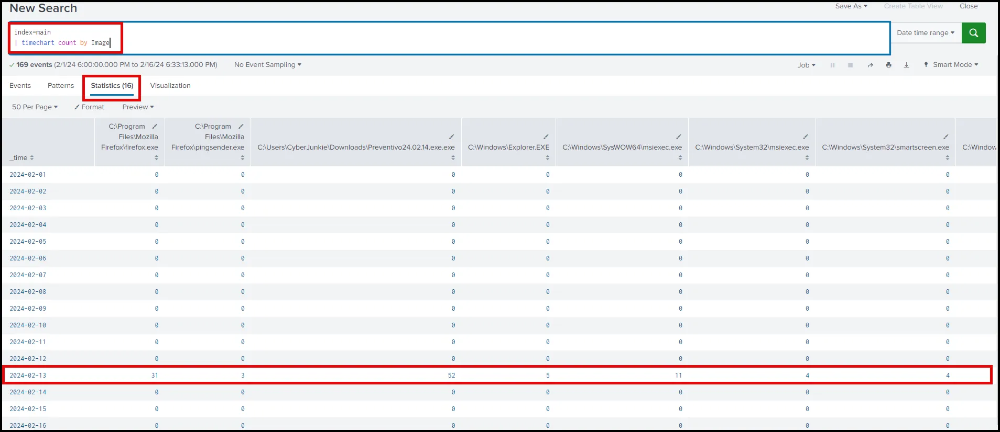

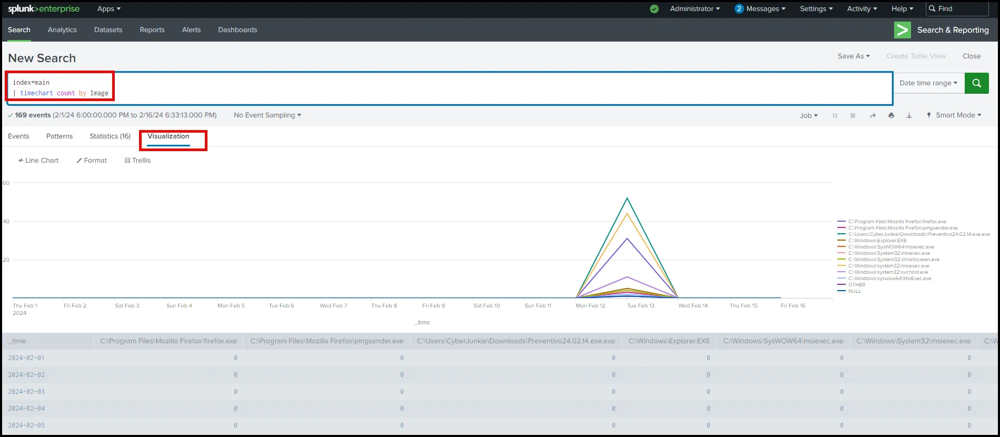