# Sysmon Familiarization using Splunk

### Summary:

This exercise is intended to demonstrate Sysmon’s value while using Splunk. The dataset is from PaloAlto and was used in a HackTheBox challenge. The questions are from the HackTheBox challenge.

### **Objective:**

 Become familiar with Sysmon logs and various useful EventIDs for identifying and analyzing malicious activities on a Windows system. 

### Exercise Setup:

Download the Sysmon logs from this link:

[Microsoft-Windows-Sysmon-Operational.evtx](Files/Microsoft-Windows-Sysmon-Operational.evtx)

Import the logs into Splunk. 

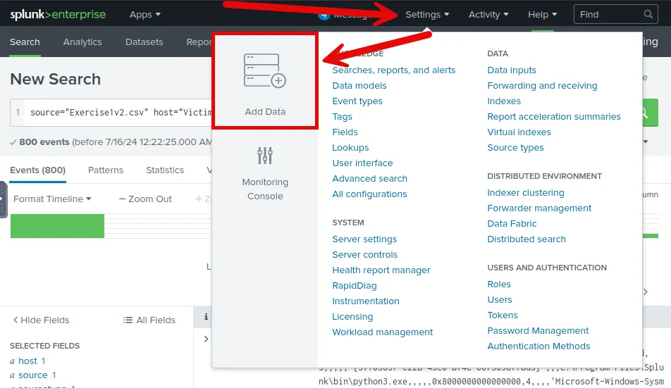

Select Monitor.

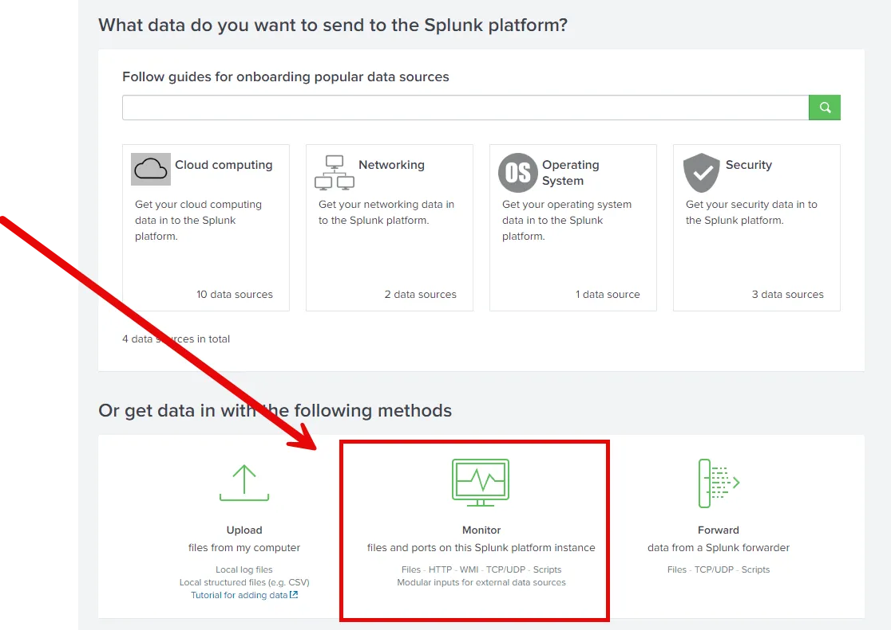

Select Files and Directories.

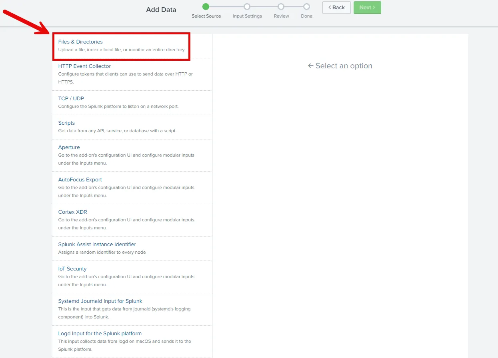

Browse to the directory.

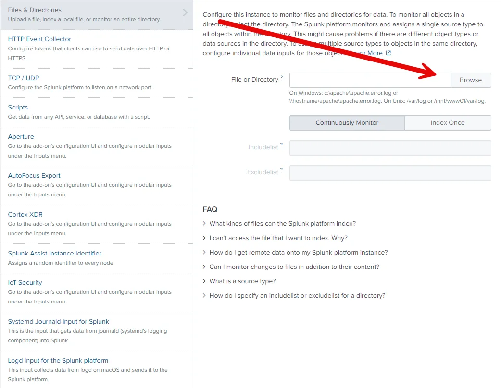

Select the Sysmon logs.

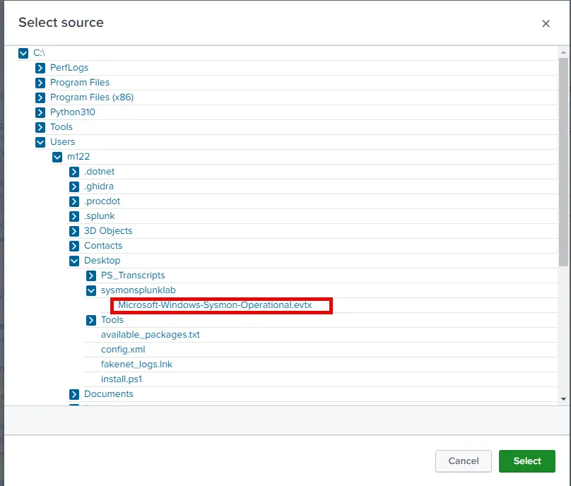

Select “Next” and change the index name to “sysmonsplunklab”

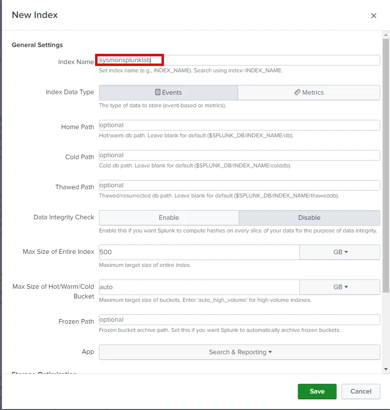

Select “Start Searching”

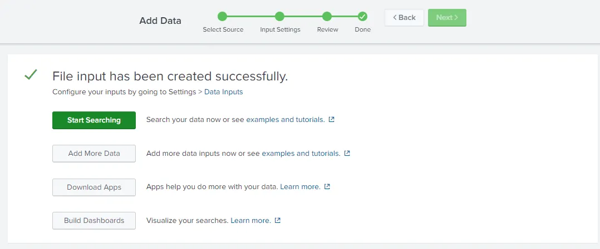

At first, there will be no events.

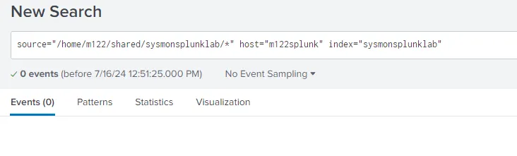

Delete everything from the search window except “index=”sysmonsplunklab”

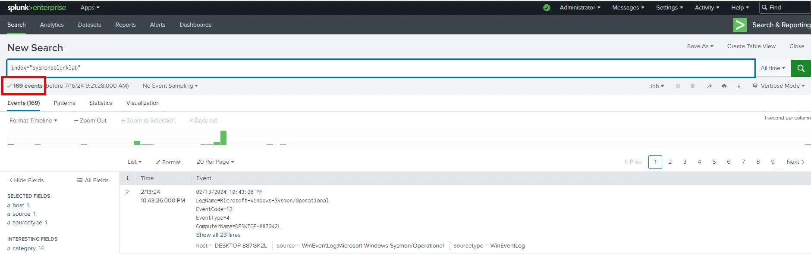

Change the Time Zone in Splunk to GMT.

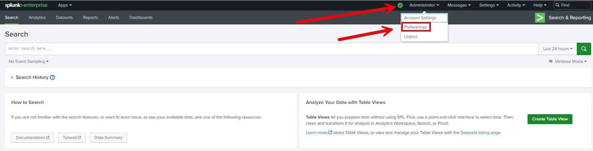

Select GMT.

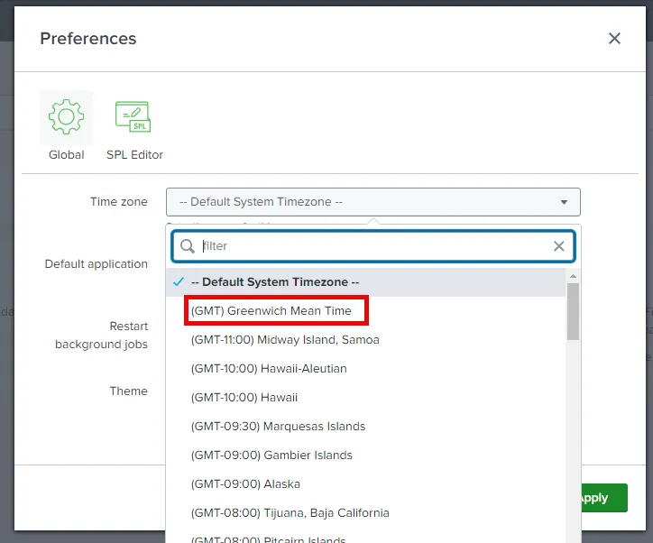

You are now ready to begin the exercise.

## Scenario

“Palo Alto's Unit42 recently conducted research on an UltraVNC campaign, wherein attackers utilized a backdoored version of UltraVNC to maintain access to systems. This lab is inspired by that campaign and guides participants through the initial access stage of the campaign.”

## Reference

As a review, the Sysmon Event IDs are listed below. They will assist in answering the questions.

**Event ID 1: Process creation**
The process creation event provides extended information about a newly created process. The full command line provides context on the process execution. The ProcessGUID field is a unique value for this process across a domain to make event correlation easier. The hash is a full hash of the file with the algorithms in the HashType field.

**Event ID 2: A process changed a file creation time**
The change file creation time event is registered when a file creation time is explicitly modified by a process. This event helps tracking the real creation time of a file. Attackers may change the file creation time of a backdoor to make it look like it was installed with the operating system. Note that many processes legitimately change the creation time of a file; it does not necessarily indicate malicious activity.

**Event ID 3: Network connection**
The network connection event logs TCP/UDP connections on the machine. It is disabled by default. Each connection is linked to a process through the ProcessId and ProcessGuid fields. The event also contains the source and destination host names IP addresses, port numbers and IPv6 status.

**Event ID 4: Sysmon service state changed**
The service state change event reports the state of the Sysmon service (started or stopped).

**Event ID 5: Process terminated**
The process terminate event reports when a process terminates. It provides the UtcTime, ProcessGuid and ProcessId of the process.

**Event ID 6: Driver loaded**
The driver loaded events provides information about a driver being loaded on the system. The configured hashes are provided as well as signature information. The signature is created asynchronously for performance reasons and indicates if the file was removed after loading.

**Event ID 7: Image loaded**
The image loaded event logs when a module is loaded in a specific process. This event is disabled by default and needs to be configured with the "–l" option. It indicates the process in which the module is loaded, hashes and signature information. The signature is created asynchronously for performance reasons and indicates if the file was removed after loading. This event should be configured carefully, as monitoring all image load events will generate a significant amount of logging.

**Event ID 8: CreateRemoteThread**
The CreateRemoteThread event detects when a process creates a thread in another process. This technique is used by malware to inject code and hide in other processes. The event indicates the source and target process. It gives information on the code that will be run in the new thread: StartAddress, StartModule and StartFunction. Note that StartModule and StartFunction fields are inferred, they might be empty if the starting address is outside loaded modules or known exported functions.

**Event ID 9: RawAccessRead**
The RawAccessRead event detects when a process conducts reading operations from the drive using the \\.\ denotation. This technique is often used by malware for data exfiltration of files that are locked for reading, as well as to avoid file access auditing tools. The event indicates the source process and target device.

**Event ID 10: ProcessAccess**
The process accessed event reports when a process opens another process, an operation that’s often followed by information queries or reading and writing the address space of the target process. This enables detection of hacking tools that read the memory contents of processes like Local Security Authority (Lsass.exe) in order to steal credentials for use in Pass-the-Hash attacks. Enabling it can generate significant amounts of logging if there are diagnostic utilities active that repeatedly open processes to query their state, so it generally should only be done so with filters that remove expected accesses.

**Event ID 11: FileCreate**
File create operations are logged when a file is created or overwritten. This event is useful for monitoring autostart locations, like the Startup folder, as well as temporary and download directories, which are common places malware drops during initial infection.

**Event ID 12: RegistryEvent (Object create and delete)**
Registry key and value create and delete operations map to this event type, which can be useful for monitoring for changes to Registry autostart locations, or specific malware registry modifications.

Sysmon uses abbreviated versions of Registry root key names, with the following mappings:

Key name	Abbreviation
HKEY_LOCAL_MACHINE	HKLM
HKEY_USERS	HKU
HKEY_LOCAL_MACHINE\System\ControlSet00x	HKLM\System\CurrentControlSet
HKEY_LOCAL_MACHINE\Classes	HKCR
Event ID 13: RegistryEvent (Value Set)
This Registry event type identifies Registry value modifications. The event records the value written for Registry values of type DWORD and QWORD.

**Event ID 14: RegistryEvent (Key and Value Rename)**
Registry key and value rename operations map to this event type, recording the new name of the key or value that was renamed.

**Event ID 15: FileCreateStreamHash**
This event logs when a named file stream is created, and it generates events that log the hash of the contents of the file to which the stream is assigned (the unnamed stream), as well as the contents of the named stream. There are malware variants that drop their executables or configuration settings via browser downloads, and this event is aimed at capturing that based on the browser attaching a Zone.Identifier "mark of the web" stream.

**Event ID 16: ServiceConfigurationChange**
This event logs changes in the Sysmon configuration - for example when the filtering rules are updated.

**Event ID 17: PipeEvent (Pipe Created)**
This event generates when a named pipe is created. Malware often uses named pipes for interprocess communication.

**Event ID 18: PipeEvent (Pipe Connected)**
This event logs when a named pipe connection is made between a client and a server.

**Event ID 19: WmiEvent (WmiEventFilter activity detected)**
When a WMI event filter is registered, which is a method used by malware to execute, this event logs the WMI namespace, filter name and filter expression.

**Event ID 20: WmiEvent (WmiEventConsumer activity detected)**
This event logs the registration of WMI consumers, recording the consumer name, log, and destination.

**Event ID 21: WmiEvent (WmiEventConsumerToFilter activity detected)**
When a consumer binds to a filter, this event logs the consumer name and filter path.

**Event ID 22: DNSEvent (DNS query)**
This event is generated when a process executes a DNS query, whether the result is successful or fails, cached or not. The telemetry for this event was added for Windows 8.1 so it is not available on Windows 7 and earlier.

**Event ID 23: FileDelete (File Delete archived)**
A file was deleted. Additionally to logging the event, the deleted file is also saved in the ArchiveDirectory (which is C:\Sysmon by default). Under normal operating conditions this directory might grow to an unreasonable size - see event ID 26: FileDeleteDetected for similar behavior but without saving the deleted files.

**Event ID 24: ClipboardChange (New content in the clipboard)**
This event is generated when the system clipboard contents change.

**Event ID 25: ProcessTampering (Process image change)**
This event is generated when process hiding techniques such as "hollow" or "herpaderp" are being detected.

**Event ID 26: FileDeleteDetected (File Delete logged)**
A file was deleted.

**Event ID 27: FileBlockExecutable**
This event is generated when Sysmon detects and blocks the creation of executable files (PE format).

**Event ID 28: FileBlockShredding**
This event is generated when Sysmon detects and blocks file shredding from tools such as SDelete.

**Event ID 29: FileExecutableDetected**
This event is generated when Sysmon detects the creation of a new executable file (PE format).

## Questions

**Question 1 How many files were created?**

As seen above, EventCode 11 is file creation. We can use the simple query below:

```go
index="sysmonsplunklab" EventCode=11
```

As seen below, there are 56 Event Code 11s.

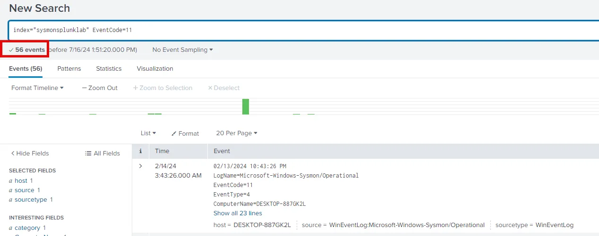

**Question 2** **Whenever a process is created in memory, an event with Event ID 1 is recorded with details such as command line, hashes, process path, parent process path, etc. This information is very useful for an analyst because it allows us to see all programs executed on a system, which means we can spot any malicious processes being executed. What is the malicious process that infected the victim's system?**

We can start with the query

```go
index="sysmonsplunklab" EventCode=1
```

Then look at the Image field. 

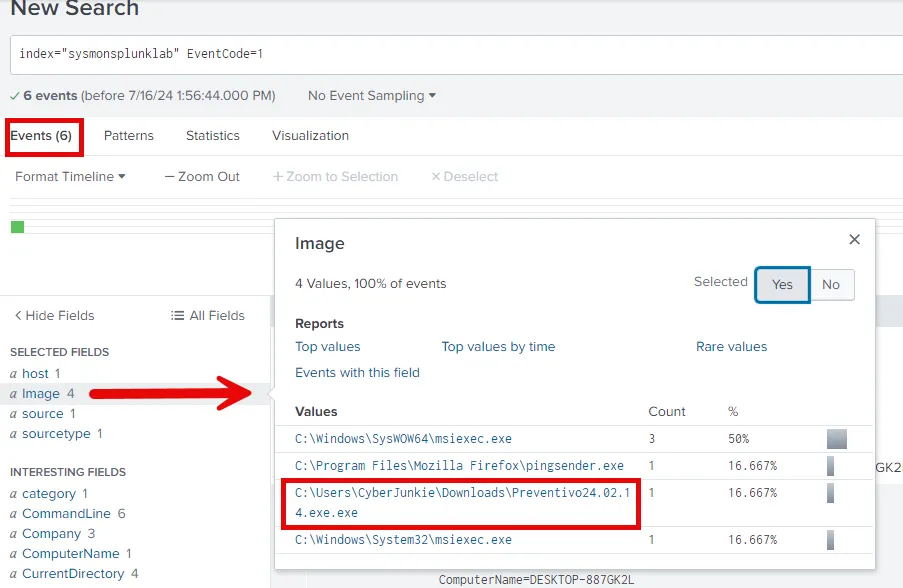

We see one file that looks suspicous. We can now look at the entire entry and grab a file hash.

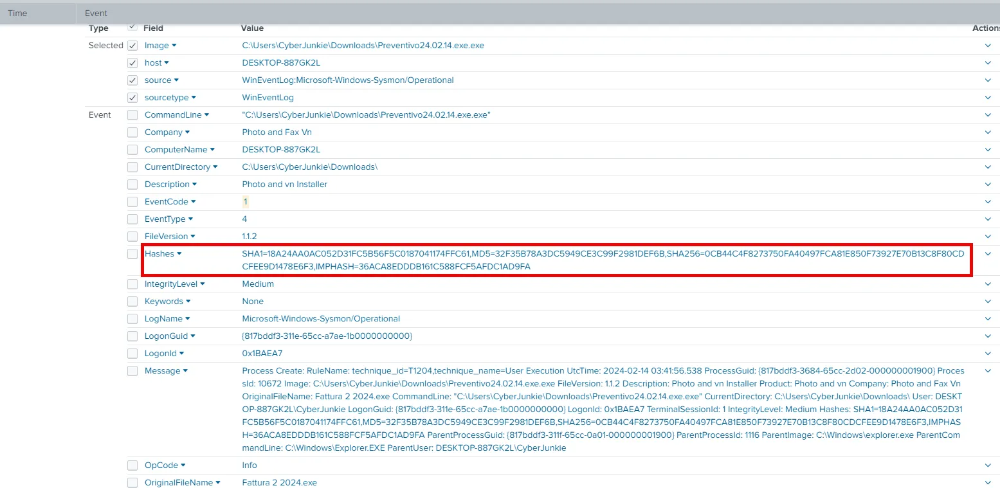

We can now copy one of the file hashes into VirusTotal to determine if the is malicious.

As seen below, 47 AV Vendors detect this file as being malicious.

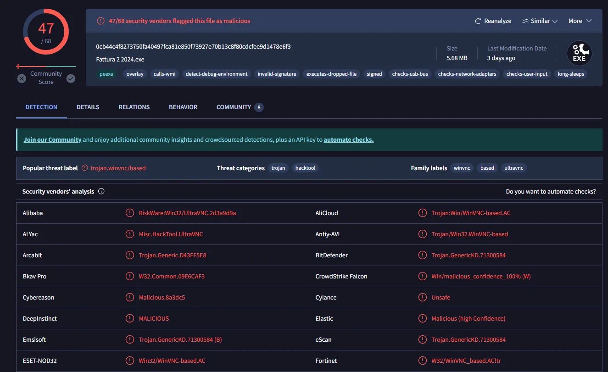

We can do the same for the other files (Images) that created an Event ID 1; however, [Preventivo24.02.14.exe.exe](http://127.0.0.1:8000/en-US/app/search/search?q=search%20index%3D%22sysmonsplunklab%22%20EventCode%3D1%20Hashes%3D%22SHA1%3D18A24AA0AC052D31FC5B56F5C0187041174FFC61%2CMD5%3D32F35B78A3DC5949CE3C99F2981DEF6B%2CSHA256%3D0CB44C4F8273750FA40497FCA81E850F73927E70B13C8F80CDCFEE9D1478E6F3%2CIMPHASH%3D36ACA8EDDDB161C588FCF5AFDC1AD9FA%22&display.page.search.mode=verbose&dispatch.sample_ratio=1&workload_pool=&earliest=0&latest=&display.events.fields=%5B%22host%22%2C%22source%22%2C%22sourcetype%22%2C%22attach_filename%7B%7D%22%2C%22sender%22%2C%22receiver%7B%7D%22%2C%22attach_type%7B%7D%22%2C%22src_ip%22%2C%22subject%22%2C%22attach_size%7B%7D%22%2C%22Image%22%5D&sid=1721138684.38#) is the only file that appears malicious. 

1. **Which Cloud drive was used to distribute the malware?**

We can actually find this out from looking at the comments in the “Community” section of Virustotal. 

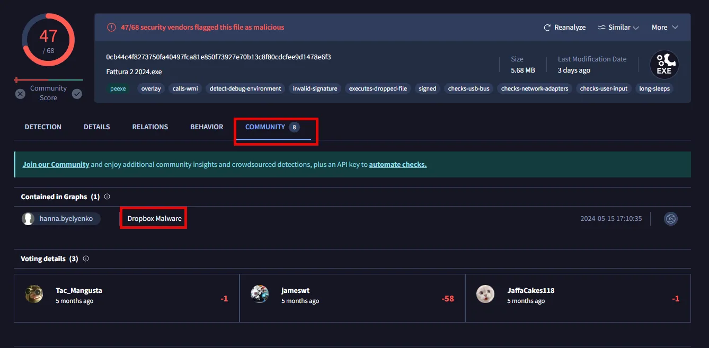

We see that the file was classified as “Dropbox Malware”. So Dropbox is likely the Cloud drive used to distribute the malware. 

We can also use Splunk by pivoting on the name of the malware and the FileCreate Event ID 11 with this query:

```go
index="sysmonsplunklab" Preventivo24.02.14.exe.exe EventCode=11
```

As seen below, there were 9 events. 

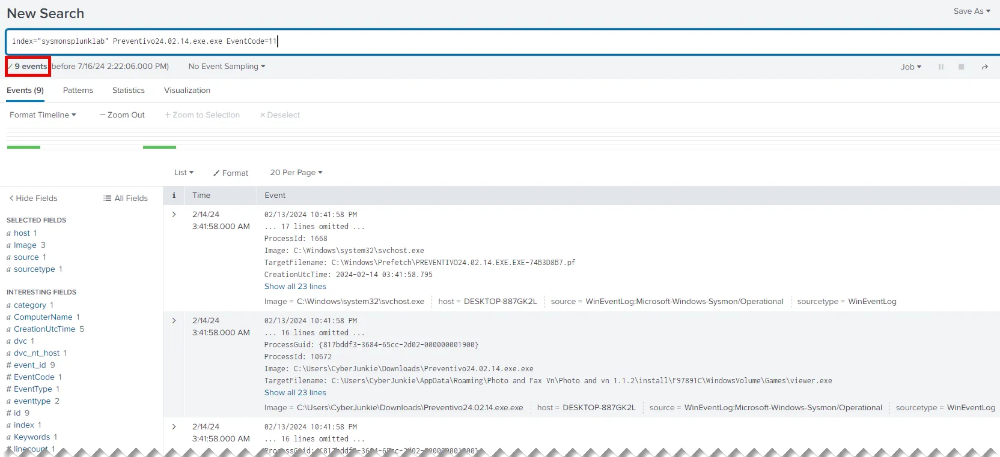

We can now pivot to the surrounding events of the first event by clicking on the time and select +/- 5 seconds. This gives us all the events that occured before and after the time the file was written to disk.

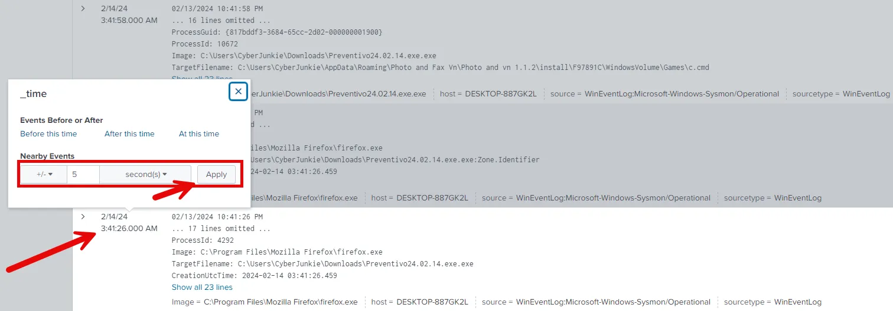

Be sure to change the filter in the query bar. This allows us to see all the surrounding events.

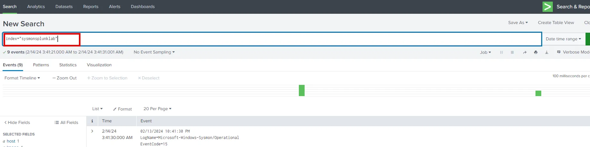

Moving down to the first event, we see EventCode 22 (DNS Query). After expanding it, we see the DNS query was for Dropbox.

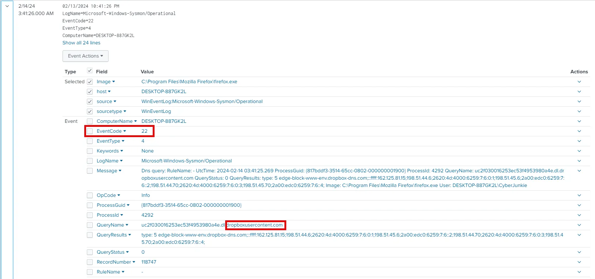

1. **The initial malicious file time-stamped (a defense evasion technique, where the file creation date is changed to make it appear old) many files it created on disk. What was the timestamp changed to for a PDF file?**

We can start by crafting a query looking for time stomping by using Sysmon EventCode 2. Since the question is asking about timestomping a PDF file, we can add “pdf” to our query.  BE SURE TO CHANGE THE TIME FILTER (remember in the previous question we narrowed it down to +/-5 seconds. I set it to “All Time” since it is a small dataset.

```go
index="sysmonsplunklab" EventCode=2 pdf
```

As seen below, we get 1 hit.

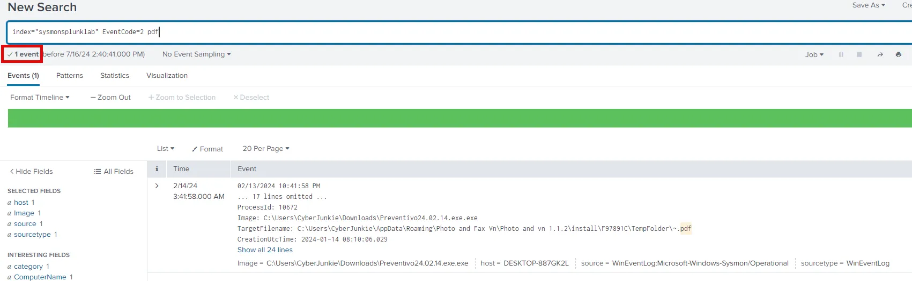

As seen below, if we expand that event we can see the time was changed to [2024-01-14 08:10:06.029](http://127.0.0.1:8000/en-US/app/search/search?q=search%20index%3D%22sysmonsplunklab%22%20EventCode%3D2%20pdf&display.page.search.mode=verbose&dispatch.sample_ratio=1&workload_pool=&earliest=0&latest=&display.events.fields=%5B%22host%22%2C%22source%22%2C%22sourcetype%22%2C%22attach_filename%7B%7D%22%2C%22sender%22%2C%22receiver%7B%7D%22%2C%22attach_type%7B%7D%22%2C%22src_ip%22%2C%22subject%22%2C%22attach_size%7B%7D%22%2C%22Image%22%5D&sid=1721140840.68#) and timestomping was the technique used.

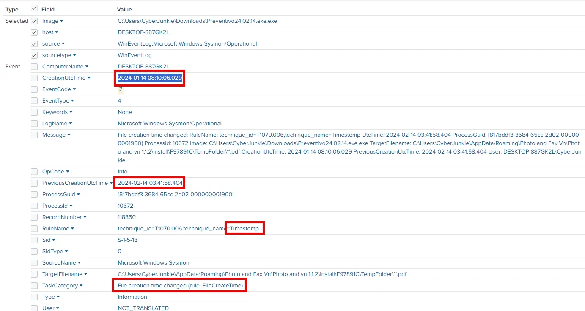

 

1. **The malicious file dropped a few files on disk. Where was "once.cmd" created on disk? Please answer with the full path along with the filename.**

We can answer this question by using EventCode 11 and the name “once.cmd” in the query below.

```go
index="sysmonsplunklab" EventCode=11 once.cmd
```

As see below, we got two hits. Looking at the first entry (from bottom) we see the path.

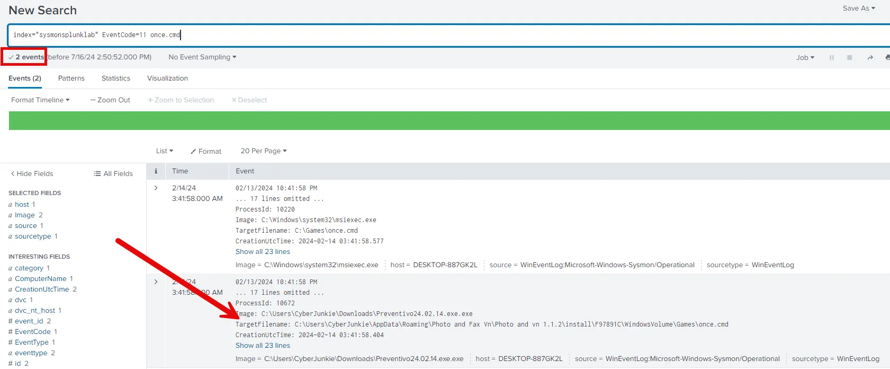

1. **The malicious file attempted to reach a dummy domain, most likely to check the internet connection status. What domain name did it try to connect to?**

We can craft a query using EventCode 22 (DNS request) and the name of the malicious file (preventivo24)

```go
index="sysmonsplunklab" EventCode=22 preventivo24
```

As seen below we recieved one hit and can see the domain (example.com)

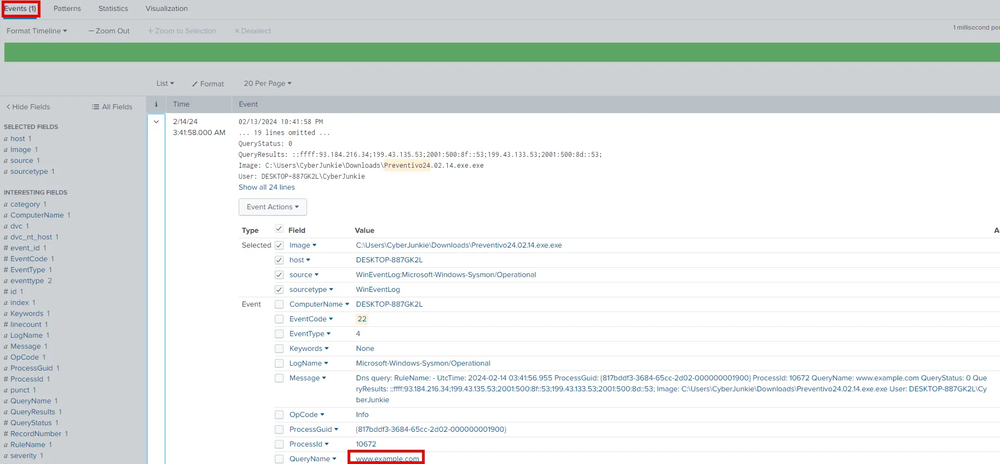

7.**Which IP address did the malicious process try to reach out to?**

We can craft a query using EventCode 3 (Network Connection) and the name of the malicious file.

```go
index="sysmonsplunklab" EventCode=3 preventivo24
```

As seen below, we got one hit and can see the IP address (93.184.216.34)

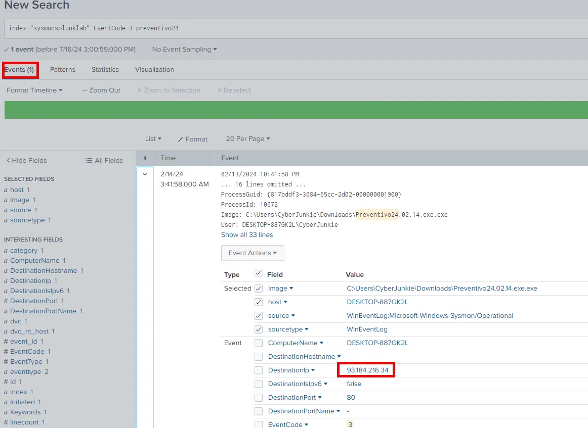

1. **The malicious process terminated itself after infecting the PC with a backdoored variant of UltraVNC. When did the process terminate itself?**

We can craft a query using EventCode 5 (Process Terminated) and the malicous file name.

```go
index="sysmonsplunklab" EventCode=5 preventivo24
```

As seen below, there was one hit and we can get the time from the event.

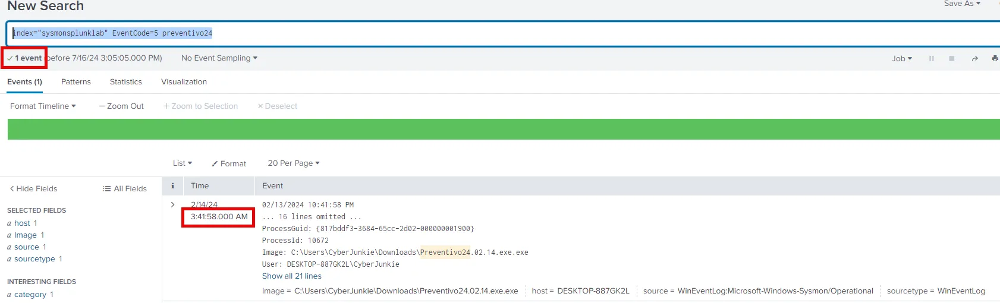

## Conclusion

This exercise shows the value of Sysmon logging when conducting an investigation.