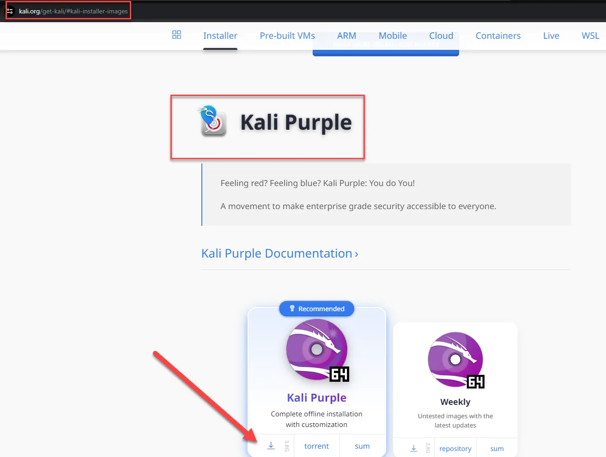
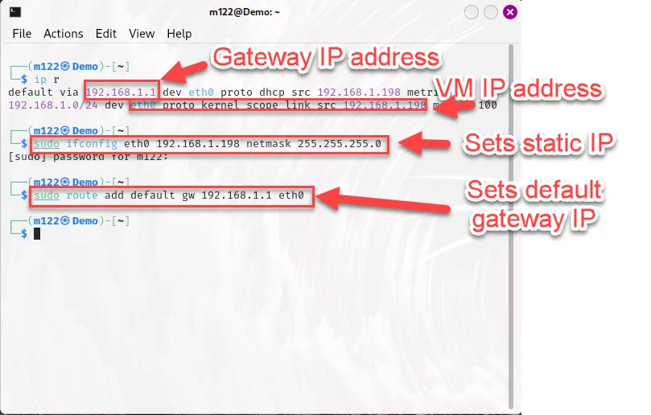

# Elastic Part 1: Install Elastic

The purpose of this document is to provide a walkthrough of installing Elastic on Kali Purple. It is based on the Kali Purple documentation; however, the official documentation is not entirely intuitive and there are a few critical items missing.  


Download Kali Purple .iso from this link.

[Get Kali | Kali Linux](https://www.kali.org/get-kali/#kali-installer-images)

Ensure you scroll to the bottom of the page to the Kali Purple downloads.



Once it is downloaded, open your hypervisor. In this example we are using VirtualBox. Select the Machine tab and then select New.


Give the VM a name and and then use the drop down on ISO Image and navigate to where you downloaded the Kali Purple .iso.


Select next and assign resources to your VM, as seen below. This may vary based on the resources of your host system. Ensure you save enough resources for an additional VM.  


Select next and create the virtual hard disk. Once again it is based on the resources of your host system.  Do not select the Pre-allocate Full Size. 


Click next and ensure the settings are correct and then select Finish.


Once completed start the VM and open a terminal window and follow the instructions below.

## Set a Static IP Address

It is important to set a static IP address to any server. If you use DHCP your server could receive a different IP address and your hosts would not be able to communicate with it. This is especially true with the Elastic server because the configuration and agents are dependent on the IP address to send logs. 

You can set the static IP address with a few simple commands. While it is best practice to set it before configuring Elastic, it can still done after Elastic is configured as long as the VM still has the same IP address that it had when you configured it.

You do not have to change the IP address from the original IP address assigned to it. The first thing you need to do is confirm the IP address and the netmask. 

```powershell
ip a
```

As seen below the command gives the IP address as well as the netmask.


You can discover the default gateway by using the command below.

```powershell
ip r
```

The screenshot below shows the default gateway IP address (192.168.1.1), the ethernet adaptor name (eth0), and the VM’s IP address (192.168.1.198). 

As shown below, you can make that IP address static by using the following command:

```powershell
 sudo ifconfig eth0 10.0.0.12 netmask 255.255.255.0
```

Set the default gateway using the following command:

```powershell
sudo route add default gw 10.0.0.1 eth0 
```



### Conclusion

Ensure you set a static IP on your Elastic server to avoid potential issues if the server is assigned a different IP address.

## Install Elastic Stack

1. Install elasticsearch. The update will may take a long time to run.

```powershell
sudo apt update && sudo apt upgrade
```

```powershell
sudo bash -c "export HOSTNAME=kali-purple.kali.purple; apt-get install elasticsearch -y"
```

After you run the code above, scroll up and copy and paste the password into a text file.


You will need the password several times as you go through the installation, so paste it into a .txt document.


You should also get the IP address of Kali Purple and record that in the .txt document as well.

```powershell
ip a
```


Update the /etc/hosts file.

```powershell
sudo nano /etc/hosts
```

Add this line to the /etc/hosts file. Use the IP address of your VM. 


Save the /etc/hosts file.

Run the commands below to configure elasticsearch service to start automatically.

```powershell
sudo systemctl daemon-reload
```

```powershell
sudo systemctl enable elasticsearch.service
```

```powershell
sudo systemctl start elasticsearch.service
```

### Set up Elastic as a single node

```powershell
sudo sed -e '/cluster.initial_master_nodes/ s/^#*/#/' -i /etc/elasticsearch/elasticsearch.yml
```

```powershell
echo "discovery.type: single-node" | sudo tee -a /etc/elasticsearch/elasticsearch.yml
```

### Install Kibana

```powershell
sudo apt install kibana
```

```powershell
sudo /usr/share/kibana/bin/kibana-encryption-keys generate -q
```

```powershell
echo "server.host: \"kali-purple.kali.purple\"" | sudo tee -a /etc/kibana/kibana.yml
```

```powershell
sudo systemctl enable elasticsearch kibana --now
```

```powershell
sudo systemctl restart elasticsearch
```

### Enroll Kibana

```
sudo /usr/share/elasticsearch/bin/elasticsearch-create-enrollment-token -s kibana

```

The above command produces a token. As seen below.


Copy the token in the clipboard.

If you received an error, run the command below to ensure [elastic](http://elastic.search)search service is running and then re-run the command for the token.

```powershell
sudo systemctl restart elasticsearch
```

Open a webbrowser and navigate to Elastic using the url http://<your ip>:5601. Paste the token in the box, as seen below.


You will be prompted for a verification code. See below.


Run this command to get the code:

```
sudo /usr/share/kibana/bin/kibana-verification-code

```

Insert the code. 


### Enable HTTPS for Kibana

Move back to the terminal window and enter the following commands.  Every time you are prompted for a password use the password you pasted into the .txt document. 

```powershell
sudo /usr/share/elasticsearch/bin/elasticsearch-certutil ca
```

When prompted for the desired output file, just select enter.


The following commands will prompt you for the password multiple times.

```go
sudo /usr/share/elasticsearch/bin/elasticsearch-certutil cert --ca elastic-stack-ca.p12 --dns kali-purple.kali.purple,elastic.kali.purple,kali-purple --out kibana-server.p12
```

```go
sudo openssl pkcs12 -in /usr/share/elasticsearch/elastic-stack-ca.p12 -clcerts -nokeys -out /etc/kibana/kibana-server_ca.crt
```

```go
sudo openssl pkcs12 -in /usr/share/elasticsearch/kibana-server.p12 -out /etc/kibana/kibana-server.crt -clcerts -nokeys
```

```go
sudo openssl pkcs12 -in /usr/share/elasticsearch/kibana-server.p12 -out /etc/kibana/kibana-server.key -nocerts -nodes
```

```go
sudo chown root:kibana /etc/kibana/kibana-server_ca.crt
```

```go
sudo chown root:kibana /etc/kibana/kibana-server.key
```

```go
sudo chown root:kibana /etc/kibana/kibana-server.crt
```

```go
sudo chmod 660 /etc/kibana/kibana-server_ca.crt
```

```go
sudo chmod 660 /etc/kibana/kibana-server.key
```

```go
sudo chmod 660 /etc/kibana/kibana-server.crt
```

```go
echo "server.ssl.enabled: true" | sudo tee -a /etc/kibana/kibana.yml
```

```go
echo "server.ssl.certificate: /etc/kibana/kibana-server.crt" | sudo tee -a /etc/kibana/kibana.yml
```

```go
echo "server.ssl.key: /etc/kibana/kibana-server.key" | sudo tee -a /etc/kibana/kibana.yml
```

```go
sudo /usr/share/kibana/bin/kibana-encryption-keys generate
```

Copy the keys and paste into a text document.


Change permissions for /etc/kibana and /etc/kibana/kibana.yml

```jsx
sudo chown 766 /etc/kibana
```

```jsx
sudo chown 766 /etc/kibana/kibana.yml
```


Open the kibana.yml file with nano and paste the keys at the bottom of the file.

```jsx
sudo nano  /etc/kibana/kibana.yml
```


Save the file.

Lastly, run the command below.

```powershell
sudo systemctl restart kibana
```

### Open Elastic

Open the browser and navigate to Elastic, ensure you use HTTPS. 

https://<your ip>:5601/

You will receive a warning. Click Advanced.


Accept the risk and continue.


Log into Elastic using the username “elastic” and the password you recorded earlier.

 


You now have Elastic up and running on Kali Purple.


We will configure Elastic in the next lesson.