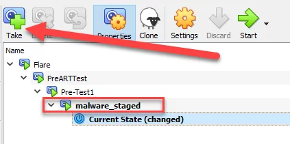

# Elastic Part 2: Configure Elastic

## Summary

We will configure Elastic and install agents on our Windows VM so that we can parse logs and other Windows artifiacts using Elastic (hosted on Kali Purple) as our SIEM.

## Background

We have already installed Elastic on Kali Purple and built a Windows VM. The next step in our lab is to configure the SIEM. 

## Steps

Using a browser navigate to your SIEM dashboard by typing in https://<your Siem IP>:5601.

Log into Elastic with the username “elastic” and the password you recorded during installation.

 Open Integrations and select Elastic Defend.


Select add Elastic Defend


Name the integration. I used “Windows Elastic Defend”, as seen below. 


Scroll down and select Complete EDR and give a name to the new agent policy. I named it Windows Agent policy 1. The select “Save and continue”


Before we can add an agent to our hosts, we need to enroll in Fleet. Select “Add Fleet Server”


Name the Fleet Server and provide the URL (https://<IP address of Elastic>:8220). Be sure to include the port number 8220.


Once the Fleet Server policy has been created, we must install the Fleet Server to the Kali purple host. Copy the Linux Tar script and paste it into the Kali Purple terminal.


Select “Add Agent” and then open the Windows tab and copy the PowerShell command.


```powershell
Paste the PowerShell command into Notepad on the Windows VM. Add the text “--insecure”  at the end of the PowerShell script. 
```


Then copy the script from Notepad and paste into an Administrator PowerShell terminal.

 


Select “Y” to install.

When installed successfully, a message will state “Successfully enrolled the Elastic Agent” 


As seen below, the VMsd should be listed in Fleet.


To add anothe integration, go to Integrations and search for the Windows integration.


Select add Windows.


Name the integration “windows-1” and select Save and continue.


Select “Save and deploy”.  The deployed agent will be automatically be updated with this integration.


The screenshot below shows the added integrations.


## Testing the Elastic Defend Integration

Download Atomic Red Team Attack Script from one of these links:

https://drive.google.com/file/d/1LGFSmarbZL5NqlLQhQbWODPXu04eZ68Z/view?usp=sharing

https://drive.google.com/file/d/1sw_lJgCIfamAwsN1MPvIF5FBQJS9V0tu/view?usp=sharing

Download Atomic Red Team Cleanup Script from one of these links:

https://drive.google.com/file/d/1NrA17kdN0NjB14gqlsqEp9Q_RoT7GOQk/view?usp=sharing

https://drive.google.com/file/d/1SexqRAO2yiUp1IxSJ4rZ9Gya8F6dk_94/view?usp=sharing

Create a snapshot on the VM called malware staged.



After launching the Atomic Red Team PowerShell script on our Windows VM.

 


Note that the emulated malware was prevented. Prevention is the default setting for Elastic Defend. However, we can change it to detection by editing the integration. This demonstrates that the Elastic Defend integration is performing correctly.


## Test Elastic Discover

A quick query for PowerShell script block (event code 4104) shows PowerShell importing the Atomic Red Team module.


## Conclusion

We have successfully deployed an Elastic agent to our victim VM and installed two integrations, Elastic Defend and Windows. These integrations will record suspicious behavour and ingest key logs from our victim PC to our SIEM. We are now ready to test our ability to respond to incidents and conduct threat hunt operations within our labs.