# Intro to Wazuh Part 1: Setup and Detecting Malware

## Summary

In today’s lesson we will cover installing and a brief introduction on using Wazuh. We will download and deploy the Wazuh .ova. As always, you can use the hypervisor of your choice; however, the walkthrough is targeted to VirtualBox users.

## Background

Wazuh is an open-source security monitoring platform designed for threat detection, integrity monitoring, incident response, and compliance. It originated as a fork of the OSSEC project (Open Source Host-based Intrusion Detection System), but has since evolved into a more comprehensive security solution. Wazuh delivers robust security monitoring and protection for IT assets using its Security Information and Event Management (SIEM) and Extended Detection and Response (XDR) capabilities. Wazuh use cases are designed to safeguard digital assets and enhance organizations’ cybersecurity posture.

## Lab Setup

Download the Wazuh .ova file and import it to you hypervisor. You can download it from this link.

https://packages.wazuh.com/4.x/vm/wazuh-4.7.4.ova

Download Mimikatz to your Windows VM using PowerShell. **Be sure to change the user from m122 in the -OutFile path.**

```powershell
Invoke-WebRequest -Uri https://github.com/ParrotSec/mimikatz/archive/refs/heads/master.zip -OutFile C:/Users/m122/Downloads/mimikatz.zip
```

## Download and Deploy Wazuh OVA

Wazuh provides a pre-built virtual machine image in Open Virtual Appliance (OVA) format. This can be directly imported to VirtualBox or other OVA compatible virtualization systems

**Import and access the virtual machine**
1. Import the OVA to the virtualization platform.

<aside>
💡

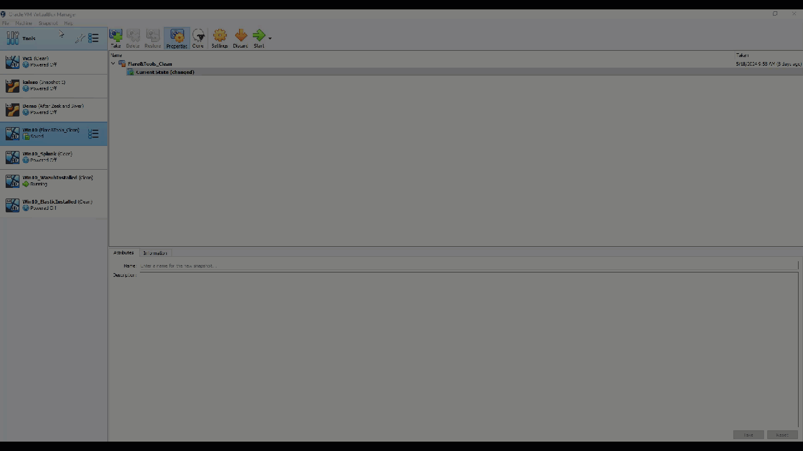

</aside>

2. If you're using VirtualBox, set the `VMSVGA` graphic controller. Setting another graphic controller freezes the VM window.
    1. Select the imported VM.
    2. Click **Settings** > **Display**
    3. In **Graphic controller**, select the `VMSVGA` option.

<aside>
💡

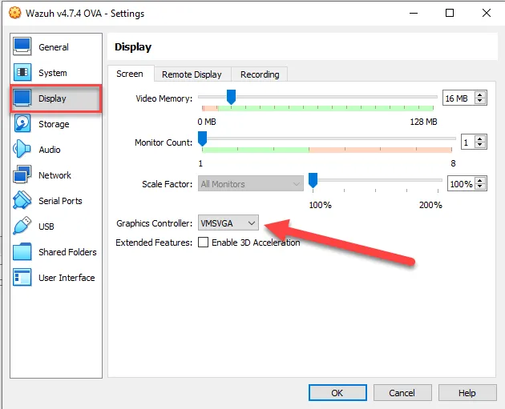

</aside>

3. Start the machine.
4. Access the virtual machine using the following user and password. You can use the virtualization platform or access it via SSH. It is easiest to access via SSH using Putty so that copy/paste functions properly. 

`user: wazuh-user
password: wazuh`

SSH `root` user login has been deactivated; nevertheless, the `wazuh-user` retains sudo privileges. Root privilege escalation can be achieved by executing the following command:

`sudo -i`

## **Access the Wazuh dashboard**

Shortly after starting the VM, the Wazuh dashboard can be accessed from the web interface by using the following credentials:

> 
> 
> 
> `URL: https://<wazuh_server_ip>
> user: admin
> password: admin`
> 

You can find `<wazuh_server_ip>` by typing the following command in the VM:

> `ip a`
> 

Using the credentials above log into Wazuh.

<aside>
💡

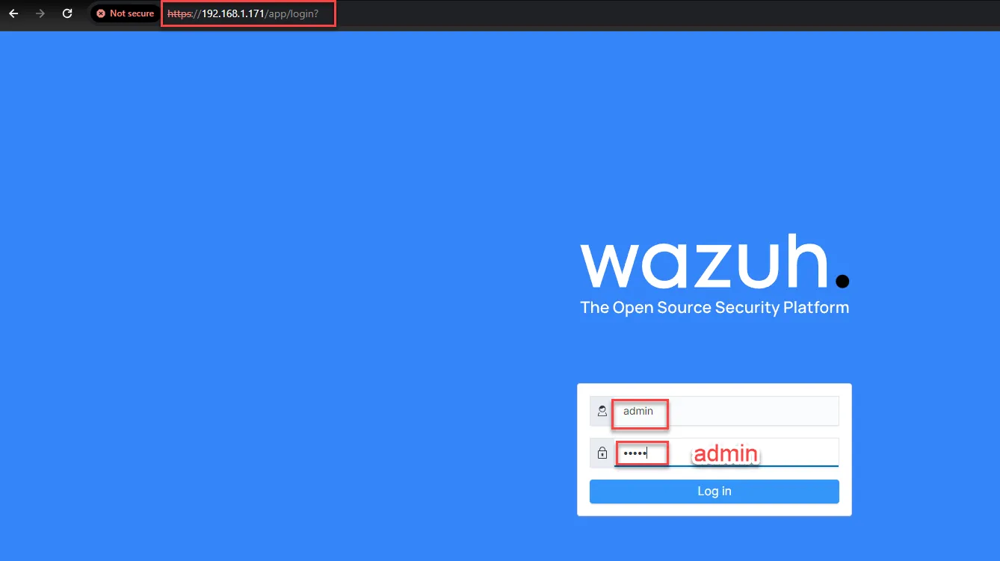

</aside>

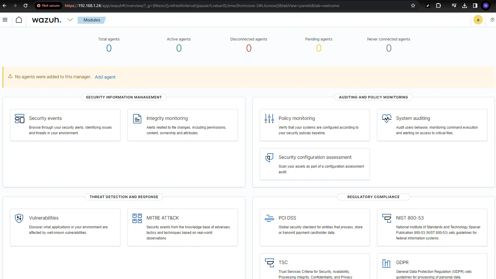

## Set a Static IP Address

It is important to set a static IP address to any server. If you use DHCP your server could receive a different IP address and your hosts would not be able to communicate with it. This is especially true with the Wazuh server because the configuration and agents are dependent on the IP address to send logs. 

You can set the static IP address with a few simple commands. While it is best practice to set it before configuring Wazuh, it can still done after Wazuh is configured as long as the VM still has the same IP address that it had when you configured it.

You do not have to change the IP address from the original IP address assigned to it. The first thing you need to do is confirm the IP address and the netmask. 

```powershell
ifconfig
```

As seen below the command gives the IP address as well as the netmask.

<aside>
💡

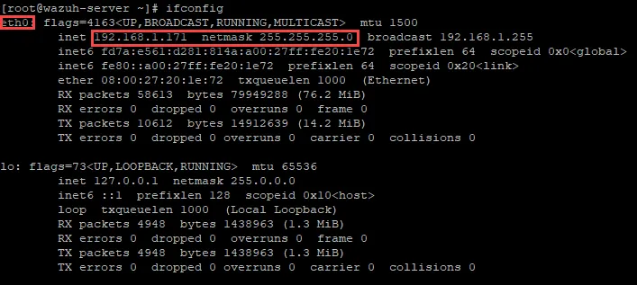

</aside>

You can discover the default gateway by using the command below.

```powershell
ip r
```

The screenshot below shows the default gateway IP address (192.168.1.1). 

<aside>
💡

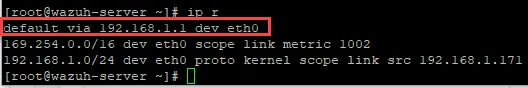

</aside>

As shown below, you can make that IP address static by using the following command:

```powershell
 sudo ifconfig eth0 192.168.1.171 netmask 255.255.255.0
```

Set the default gateway using the following command:

```powershell
sudo route add default gw 192.168.1.1 eth0 
```

<aside>
💡

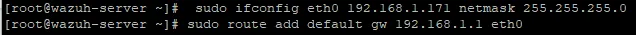

</aside>

## Create agents to deploy to the VMs.

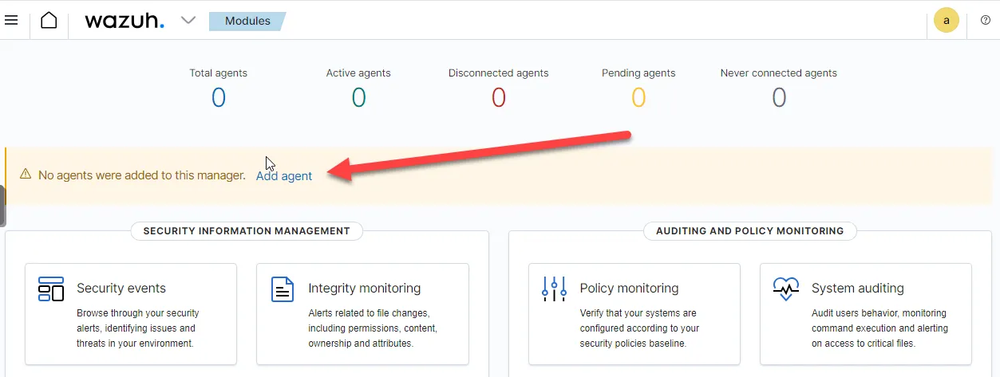

Select Windows (if installing agent on Windows) and type in the Wazuh server IP address.

<aside>
💡

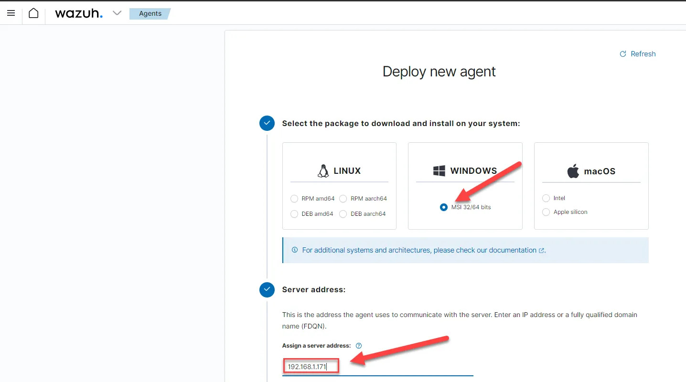

</aside>

Select Default for existing group and copy the PowerShell command. 

<aside>
💡

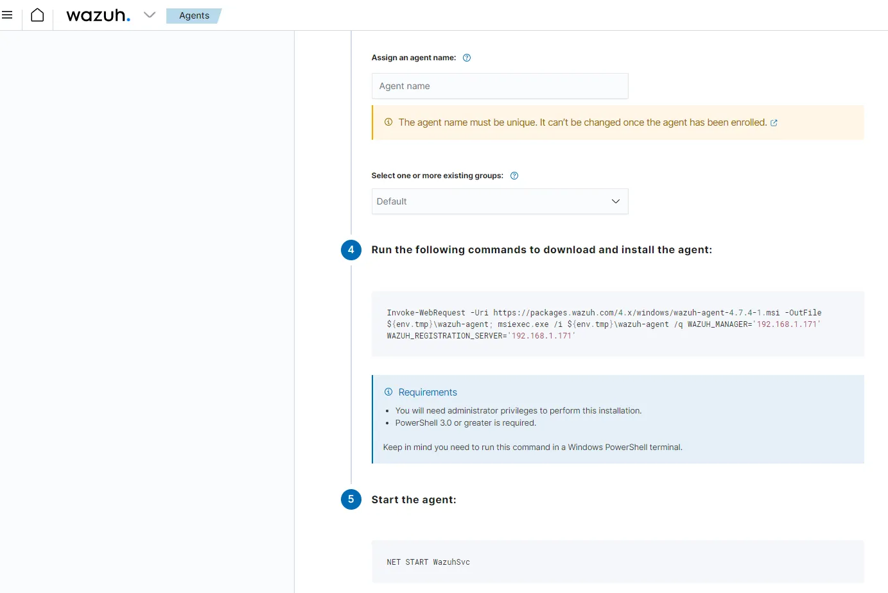

</aside>

Paste the PowerShell script on the VM that you want to install the agent. 

<aside>
💡

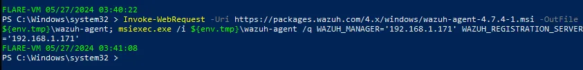

</aside>

Then start the service on the system the agent was installed with the following command:

```powershell
NET START WazuhSvc
```

<aside>
💡

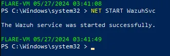

</aside>

On the Wazuh Dashboard you should now see the agent.

<aside>
💡

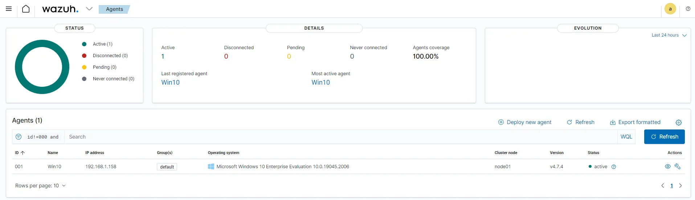

</aside>

### Configure Wazuh to Monitor Sysmon Logs

Modify Wazuh configuration to read Sysmon logs from the Windows hosts.

1. **On the Windows VM**: Use a text editor (notepad++ or notepad) as an Administrator and edit the `C:\\Program Files (x86)\\ossec-agent\\ossec.conf` file and add the following entries:

```powershell

<localfile>
    <location>System</location>
    <log_format>eventchannel</log_format>
  </localfile>
	
  <localfile>
    <location>active-response\active-responses.log</location>
    <log_format>syslog</log_format>
  </localfile>

  <localfile>
      <location>Microsoft-Windows-Sysmon/Operational</location>
      <log_format>eventchannel</log_format>
  </localfile>
```

[](Screenshots/03-Wazuh/1-Setup&Detecting/image14.avif)

1. **Restart the Wazuh service**:

```powershell

NET STOP WazuhSvc
NET START WazuhSvc
```

<aside>
💡

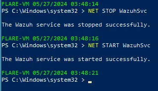

</aside>

### **Configuring Wazuh Server for Sysmon Events**

Enable the ability to ssh as root from our Windows VM:

1. **Enable root SSH access**:
    - In the Wazuh VM, edit the SSH configuration file:
    
    ```powershell
    sudo nano /etc/ssh/sshd_config
    ```
    
    - Change `##PermitRootLogin no` to `PermitRootLogin yes`
    
    <aside>
    💡
    
    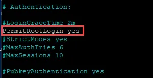
    
    </aside>
    
    [](data:image/svg+xml,%3csvg%20xmlns=%27http://www.w3.org/2000/svg%27%20version=%271.1%27%20width=%27400%27%20height=%27238%27/%3e)
    
    - Save and exit
    - Restart the SSH service: `service sshd restart`

```powershell
sudo service sshd restart
```

<aside>
💡

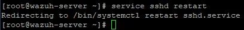

</aside>

Test it by writing some rules for detecting suspicious events related to the `mimikatz.exe` process. Mimikatz is a well-known tool for extracting Windows credentials.

1. **Write the security rules**:
    - Edit the Wazuh rules file:
    
    ```powershell
    sudo nano /var/ossec/etc/rules/local_rules.xml
    ```
    
    - Add the following entries:

```powershell
<group name="windows, sysmon, sysmon_process-anomalies,">
   <rule id="100000" level="12">
     <if_group>sysmon_event1</if_group>
     <field name="win.eventdata.image">mimikatz.exe</field>
     <description>Sysmon - Suspicious Process - mimikatz.exe</description>
   </rule>
   <rule id="100001" level="12">
     <if_group>sysmon_event8</if_group>
     <field name="win.eventdata.sourceImage">mimikatz.exe</field>
     <description>Sysmon - Suspicious Process mimikatz.exe created a remote thread</description>
   </rule>
   <rule id="100002" level="12">
     <if_group>sysmon_event_10</if_group>
     <field name="win.eventdata.sourceImage">mimikatz.exe</field>
     <description>Sysmon - Suspicious Process mimikatz.exe accessed $(win.eventdata.targetImage)</description>
   </rule>
</group>
```

[](Screenshots/03-Wazuh/1-Setup&Detecting/image17.webp)

```powershell
sudo service wazuh-manager restart
```

## Test Wazuh with Mimikatz

Extract the previously downloaded Mimikatz .zip file.

Open PowerShell as administrator and navigate to the extracted Mimikatz folder. 

<aside>
💡

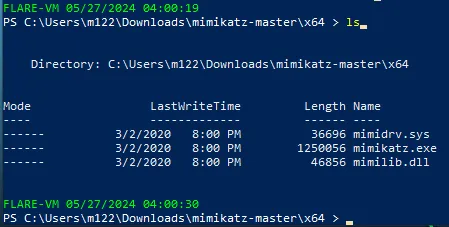

</aside>

Run the following commands:

```powershell
.\mimikatz.exe
```

**`.\mimikatz.exe`**: This command executes the Mimikatz executable file. The **`.\`** at the beginning specifies that the file is located in the current directory.

```powershell
privilege::debug
```

**`privilege::debug`**: This command instructs Mimikatz to enable debug privileges. Debug privileges are powerful permissions that allow a user to interact directly with system processes and memory, potentially bypassing security mechanisms.

```powershell
log mimikatz.log
```

**`log mimikatz.log`**: This command sets up logging, directing the output of Mimikatz commands to a file named **`mimikatz.log`**. This can be useful for later analysis or auditing purposes.

```powershell
sekurlsa::logonpasswords
```

**`sekurlsa::logonpasswords`**: This command instructs Mimikatz to retrieve and display plaintext passwords from the Windows Security Account Manager (SAM) database, which contains user account information including passwords. Mimikatz's **`sekurlsa`** module specifically deals with credentials.

<aside>
💡

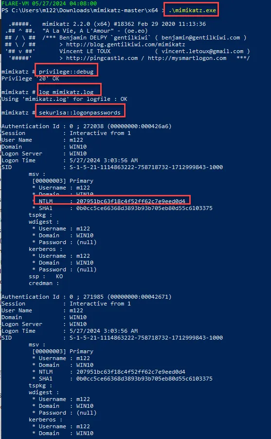

</aside>

As seen above Mimikatz was successful at retrieving the NTLM hash of the user m122. This can also be seen in the mimikatz.log file.

<aside>
💡

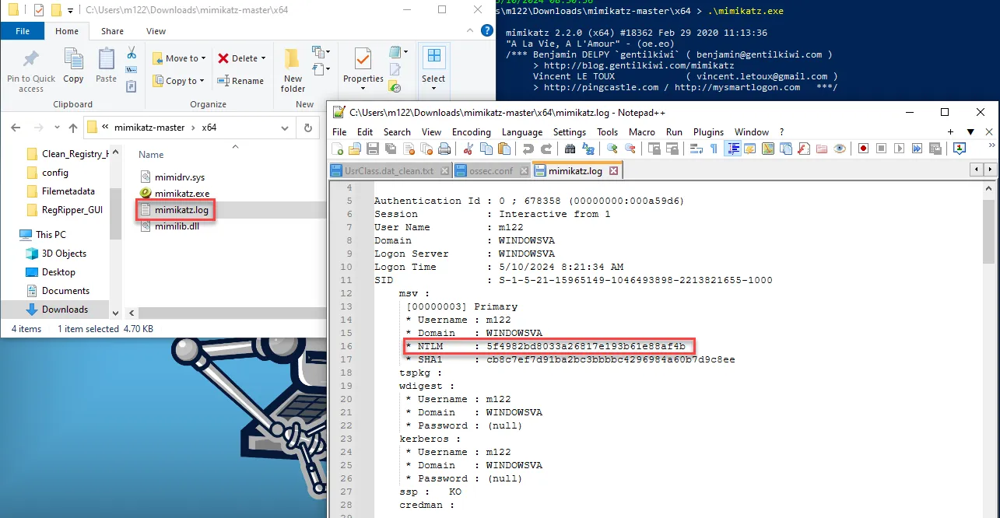

</aside>

On the Wazuh dashboard, navigate to "Security information management → Security events → Level 12 or above alerts" and you will be able to see alerts related to the Mimikatz activities.

<aside>
💡

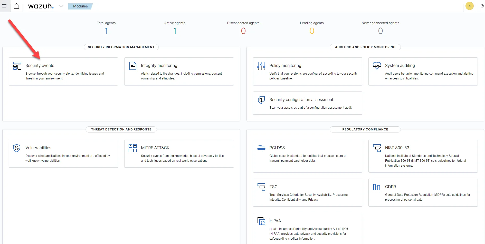

</aside>

<aside>
💡

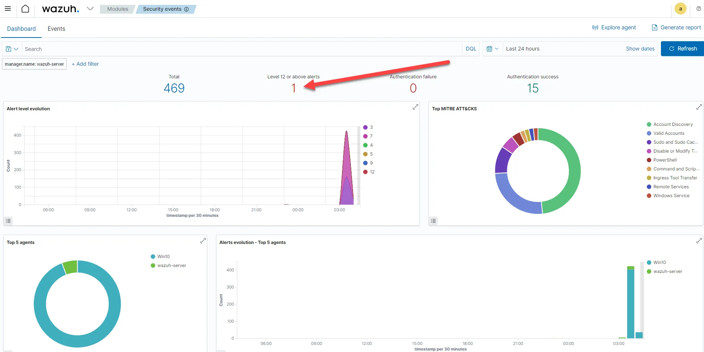

</aside>

<aside>
💡

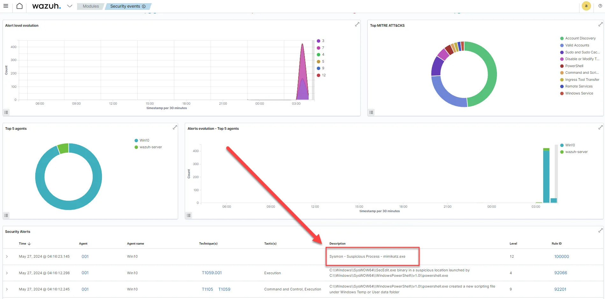

</aside>

This demonstrates that Sysmon logs are successfully being imported into Wazuh.

## Malware Detection using Wazuh

Now that we have successfully tested Wazuh, we will dig a little deeper into detecting malware with Wazuh. Wazuh's effectiveness in malware detection stems from its diverse array of capabilities. It achieves this through a blend of log analysis, intrusion detection, and leveraging threat intelligence. Additionally, Wazuh offers real-time alerting, event correlation, and supports the execution of custom scripts for automated responses. 

Wazuh employs various methods to bolster its malware detection capabilities:

- **Threat detection rules and File Integrity Monitoring (FIM):** File Integrity Monitoring is a security measure used to detect unauthorized changes to files and directories. It involves monitoring and assessing the integrity of files and their attributes on a system or network. Wazuh utilizes predefined threat detection rules to continuously monitor critical file modifications. This proactive approach aims to identify suspicious activities, events, and patterns indicative of malware infections or security breaches. FIM is a cornerstone of Wazuh's malware detection strategy, monitoring file and directory changes for unauthorized or unexpected alterations that may signal malware activity.
- **Rootkit behavior detection:** Wazuh employs its rootcheck function to uncover anomalies suggestive of malware presence within endpoints. Rootkits, a type of stealthy malware, evade detection by concealing their actions on compromised systems. Wazuh employs behavior-based detection techniques to spot rootkit-like activities, such as unauthorized privilege escalation or attempts to obfuscate files or processes. Upon detection, alerts are triggered to prompt further investigation and response.
- **VirusTotal integration:** Wazuh enhances its malware detection capabilities through integration with VirusTotal, a web-based service that scans files and URLs for potential threats using multiple antivirus engines and threat intelligence sources. When encountering a suspicious file or URL, Wazuh automatically submits it for analysis by VirusTotal. The results, incorporating findings from multiple antivirus engines, are integrated into Wazuh's alerting mechanism. Confidence in the alert is bolstered if multiple engines flag the file as malicious.
- **YARA integration:** Wazuh leverages YARA, an open-source tool that identifies and categorizes malware artifacts based on binary patterns, to detect malware samples. YARA empowers security professionals to craft custom rules tailored to detect specific malware strains or behaviors not covered by standard Wazuh rules. These custom signatures can be seamlessly integrated into Wazuh's ruleset, enabling comprehensive monitoring of the environment for emerging threats.

**Detecting Malware with FIM and CDB (Common Database)**

The CDB list within Wazuh functions as a storage hub for unique hashes or checksums of both malicious and benign files. Wazuh's security platform conducts precise comparisons between the cryptographic representations of files found on a system and those archived in the CDB. This database includes records of users, file hashes, IP addresses, domain names, and other relevant data.

You can create a CDB list of users, file hashes, IP addresses, and domain names in a text file. A CDB list can have entries added in a `key:value` pair or a `key:only` format. Lists on CDBs can function as allow or deny lists.

 Wazuh follows the process outlined below when using CDB lists:

- **Hash creation:** CDB lists contain hashes representing both legitimate and malicious entities, such as IP addresses, malware signatures, and domain names. These hashes are unique, fixed-length values derived from the content stored in the CDB list.
- **File matching:** Wazuh generates hashes of files during system scans and cross-references them with entries in the CDB.
- **Recognition:** Wazuh identifies a file as potentially malicious if its hash corresponds to a known malicious hash in the CDB.
- **Alerting and response:** Depending on predefined policies, Wazuh can initiate alerts or actions upon detection.

**Wazuh server setup for malware detection**

To configure our Wazuh server with the CDB list containing malware hashes and establish the necessary rules to prompt alerts upon detecting a file with a matching hash, we must undertake the following steps:

1. Create a file in the CDB list: CDB lists are stored in the `/ossec/etc/lists` directory on the Wazuh server. To add a new CDB list for malware hashes, create a new file with the name `malware-hashes` using the following command:

```powershell
sudo nano /var/ossec/etc/lists/malware-hashes
```

1. Add malware hashes: We need to enter the known malware hashes in the `key:value` pair where `key` will be the actual malware hash and `value` will be the name or keyword. Now, there are several sources from where we can download and use the malware hashes for the CDB list. One of the popular sources is a list published by Nextron Systems. You can view and download the list from the official GitHub page (https://github.com/Neo23x0/signature-base/blob/master/iocs/hash-iocs.txt). For testing purposes, we will create our own using the file hash for Mimikatz.zip.  

Enter the following hash in the format shown below.

```powershell
85061FB539F0E118805729C0D9EFA99E:mimikatz
```

1. Change permissions on the file malware-hashes.

```powershell
sudo chmod 777 /var/ossec/etc/lists/malware-hashes
```

1. Add the CDB list under the default ruleset: By providing the location of the CDB list in the `<ruleset>` block, you may add a reference to the CDB list in the `/var/ossec/etc/ossec.conf` Wazuh manager configuration file by opening the configuration file and pasting the line seen below.

```powershell
sudo nano /var/ossec/etc/ossec.conf
```

```powershell

<list>etc/lists/malware-hashes</list>
```

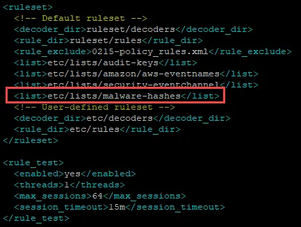

1. Write a rule to compare hashes: Create a custom rule in the Wazuh server’s `/var/ossec/etc/rules/local_rules.xml` file. When Wazuh finds a match between the MD5 hash of a recently created or updated file and a malware hash in the CDB list, this rule triggers. When an event occurs that indicates a newly created or modified file exists, rules `554` and `550` will be triggered:

```powershell
sudo nano /var/ossec/etc/rules/local_rules.xml
```

```powershell

<group name="malware,">
  <rule id="110002" level="13">
    <if_sid>554, 550</if_sid>
    <list field="md5" lookup="match_key">etc/lists/malware-hashes</list>
    <description>Known Malware File Hash is detected: $(file)</description>
    <mitre>
      <id>T1204.002</id>
    </mitre>
  </rule>
</group>
```

1. Restart the manager: We have to restart the Wazuh manager to apply the changes:

```powershell
sudo systemctl restart wazuh-manager
```

We've accomplished the creation of a CDB list containing malware hashes along with security rules for comparison against each file's hash on the Wazuh agent. Next, we'll proceed to configure a Windows endpoint to monitor file alterations, enabling it to activate the CDB list for hash comparisons.

**Configure the Windows VM**

On the Windows VM, use a text editor (notepad++ or notepad) and edit the `C:\\Program Files (x86)\\ossec-agent\\ossec.conf` file and add the following entries to track file changes in the `Downloads` folder.

```powershell
<!-- Directory Monitoring. -->
	<directories check_all="yes" realtime="yes">C:/Users/m122/Downloads</directories>
```

<aside>
💡

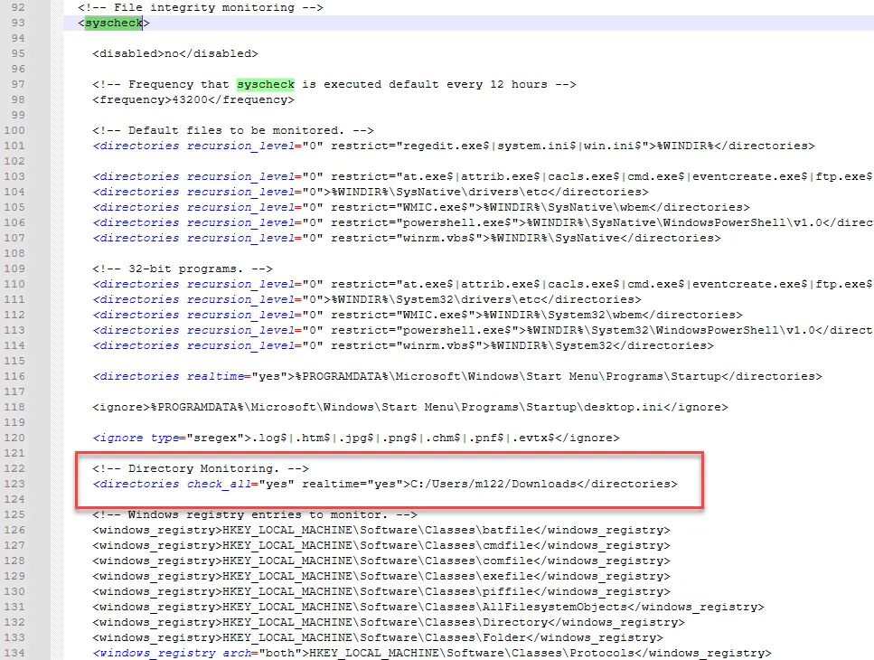

</aside>

The following is an explanation

`check_all="yes"`: This ensures that Wazuh verifies every aspect of the file, such as its size, permissions, owner, last modification date, inode, and hash sums`realtime="yes`”: Wazuh will perform real-time monitoring and trigger alerts.

Restart Wazuh service

```powershell
NET STOP WazuhSvc
NET START WazuhSvc
```

**Testing** 

We can test the file modification rules by downloading mimikatz to the download folder using the PowerShell command below.

```powershell
Invoke-WebRequest -Uri https://github.com/ParrotSec/mimikatz/archive/refs/heads/master.zip -OutFile C:/Users/m122/Downloads/mimikatz.zip
```

**Check the alerts.**

As seen below an alert was created when mimikatz.exe was downloaded to the Downloads folder.

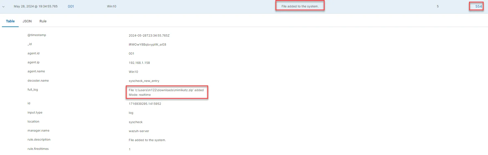

We can further test it by deleting Mimikatz.exe from the Downloads folder and then check the alerts again. 

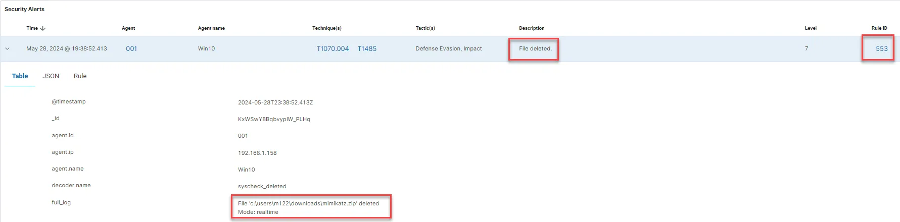
