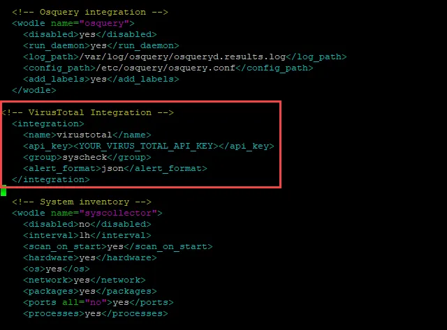

# Intro to Wazuh Part 2: VirusTotal Integration and Windows Defender, Sysmon, and PowerShell Logging

## Summary

Building on part 1, today we will implement additional integrations with Wazuh, including VirusTotal and Windows Defender, Sysmon, and PowerShell event logging. By default, Wazuh only logs events that trigger an alert. We will enable all logging, regardless if an alert is triggered. This allows us to use Wazuh as a full-fledged SIEM to conduct investigations and threat hunting.

## Lab Setup

Setup free VirusTotal account. Once logged in go to your profile and click API key. Copy the API key safely as shown in the following figure:

<aside>
💡


</aside>

## VirusTotal

VirusTotal offers a complimentary web service dedicated to scrutinizing files and URLs for any signs of malware or malicious material. Leveraging the expertise of over 70 antivirus programs and URL blocklisting specialists, it furnishes comprehensive reports on submitted files, URLs, or IP addresses. Users can actively participate by adding their own observations and comments, thereby enhancing the accuracy of the service and sharing valuable insights with the community. VirusTotal provides an API with various paid subscription options, but it also extends a free tier allowing four lookups per minute and a daily allowance of 500 lookups.

**How the VirusTotal integration works:**

- Using the FIM (File Integrity Monitoring) module in Wazuh we can monitor the files added, edited and removed etc.,
- Wazuh detects and triggers the alerts of file integrity changed within the directories configured in Wazuh by default this depends on the frequency of monitoring configured in the ossec.conf
- In this integration we are using the real-time monitoring and not the frequency of monitoring.
- After adding the particular directory in real-time monitoring and integrating Virustotal, Wazuh will detect the changes, trigger alerts, and send the extracted file hashes to VirusTotal to compare it with the information in the VirusTotal database.

**Integrate VirusTotal with Wazuh Manager**

This integration will automatically send the file hash of any new file downloaded, placed, or created to a specified folder, in our case the Downloads folder, to VirusTotal. The only reason we are limiting it to the Downloads folder is to ensure we do not exceed the daily allowance for lookups. 

Paste the VirusTotal integration configuration into the  `/var/ossec/etc/ossec.conf` file. Be sure to place your own VirusTotal API key in the <YOUR_VIRUS_TOTAL_API_KEY> placeholder.

```powershell
sudo nano /var/ossec/etc/ossec.conf
```

```powershell
<!-- VirusTotal Integration -->  
  <integration>
    <name>virustotal</name>
    <api_key>API_KEY</api_key> <!-- Replace with your VirusTotal API key -->
    <group>syscheck</group>
    <alert_format>json</alert_format>
  </integration>

```



Once again, be sure to add your own VirusTotal API key. 

Restart wazuh-manager:

```powershell
sudo systemctl restart wazuh-manager
```

**Configure Wazuh Agent**

Since we already configured FIM for the Downloads folder in part one, we do not need to change the agent. If you did not complete part one or want to check to make sure FIM was set up, see the instructions below.

On the Windows VM, use a text editor (notepad++ or notepad) and edit the `C:\\Program Files (x86)\\ossec-agent\\ossec.conf` file and add the following entries to track file changes in the `Downloads` folder.

```powershell
<!-- Directory Monitoring. -->
<directories check_all="yes" realtime="yes">C:/Users/m122/Downloads</directories>
```


### Testing

Use the PowerShell script below to download the EICAR file to your Windows VM’s Downloads folder.

The EICAR Anti-Virus Test File or EICAR test file is a computer file that was developed by the European Institute for Computer Antivirus Research (EICAR) and Computer Antivirus Research Organization (CARO), to test the response of computer antivirus programs. Instead of using real malware, which could cause real damage, this test file allows people to test anti-virus software without having to use a real computer virus. Use the PowerShell script below:

```powershell
Invoke-WebRequest -Uri https://secure.eicar.org/eicar.com -OutFile C:/Users/m122/Downloads/eicar.com
```

### **Alert**

After downloading the eicar file with the PowerShell script above, check the Alerts on the Wazuh dashboard. As seen below, the file created a VirusTotal Alert and 61 AV engines detect the file as mallicious.


Cross referencing that by manually uploading the eicar file to the VirusTotal website we see the same results. 


### VirusTotal Integration Summary

By automating the submission to VirusTotal we increased our chances to detect malicious files. In the next section, we will integrate Microsoft Defender.

## Logging vs Detection (Alerts)

By default, Wazuh logs events that trigger alerts based on configured rules. This approach is effective if we're solely focused on the alerts. However, if we aim to utilize Wazuh as a comprehensive SIEM for investigations and threat hunting, we need it to ingest all logs, not just those prompting alerts. To achieve this, we can configure Wazuh to log everything by following these steps:

1. On the Wazuh manager, use the text editor nano to edit the configuration file. 

```powershell
sudo nano /var/ossec/etc/ossec.conf
```

1. You will be changing the “logall” from no to yes. Change this:


To this:


1. Save the file by selecting ctrl-X
2. Restart Wazuh Manager.

```powershell
sudo systemctl restart wazuh-manager.service
```

1. This configuration will cause Wazuh to archive all logs that it has been configured to ingest. However, the process is not complete yet. We need to edit the filebeat.yml file using nano.

```powershell
sudo nano /etc/filebeat/filebeat.yml
```

1. Scroll down to find the filebeat.modules wazuh archives enabled:false. Change the archives enabled to true. Change this:


To this: 


1. Save the file by selecting ctrl-X
2. Restart the filebeat service.

```powershell
sudo systemctl restart filebeat
```

1. Go back to the Wazuh dashboard and select the hamburger menu in the upper right and scoll down to Management —>Stack Management


1. Select “Index Patterns” and then select “Create Index Pattern”


1. Type in wazuh-archives-*, you should see the wazuh-archive. Then select “Next Step”


1. Select “timestamp” from the drop down and then select “Create Index Pattern”.


1. Restart wazuh manager via command line.

```powershell
sudo systemctl restart wazuh-manager.service
```

1. Go back to the hamburger menu and select Discover.


1. Select wazuh-archives


## Integrating Windows Defender and PowerShell Logs

### **Windows Defender logs**

Windows Defender stands out as the predominant free antivirus solution for PC users, commanding approximately 40% of the market share among free antivirus software options. 

Windows Defender logs can play a crucial role in aiding SOC analysts to grasp the security posture of endpoints, discern potential cyber threats, and conduct thorough investigations into security incidents. These logs contain various types of data including scan activities, threat detections, updates, quarantine actions, remediation efforts, firewall and network activities, as well as real-time protection events.

By default, Wazuh does not read the Windows Defender logs; however, we can configure Wazuh to integrate Windows Defender logs.  

### PowerShell Logs

**Windows PowerShell Log**: This log captures general operational information about PowerShell, including startup, shutdown, and errors encountered during execution. You can find this log under "Applications and Services Logs" -> "Microsoft" -> "Windows" -> "PowerShell".

**Windows PowerShell Operational Log**: This log provides detailed information about PowerShell script execution, module loading, and other operational events. It's particularly useful for auditing purposes as it logs detailed information about script blocks executed within PowerShell. You can find this log under "Applications and Services Logs" -> "Microsoft" -> "Windows" -> "PowerShell" -> "Operational".

- **Script Block Logging**: PowerShell can be configured to log script block execution, capturing the contents of scripts as they're executed. This is a powerful auditing tool for tracking exactly what commands were run on a system.
- **Module Logging**: PowerShell logs information about the loading and unloading of modules. This can help administrators understand which modules are being used and when they are being accessed.
- **Transcription Logging**: PowerShell can be configured to log the input and output of PowerShell sessions, effectively recording interactive PowerShell sessions. This is particularly useful for compliance and security purposes.

### Adding logging to the ossec configuration file.

1. **On the Windows VM**: Use a text editor (notepad++ or notepad) as an Administrator and edit the `C:\\Program Files (x86)\\ossec-agent\\ossec.conf` file and add the following entries:

```powershell
	<localfile>
	  <location>Microsoft-Windows-Windows Defender/Operational</location>
	  <log_format>eventchannel</log_format>
  </localfile>
  
  <localfile>
	  <location>System</location>
	  <log_format>eventchannel</log_format>
  </localfile>
  
  <localfile>
	  <location>active-response\active-responses.log</location>
	  <log_format>syslog</log_format>
  </localfile>
  
  <localfile>
	  <location>Microsoft-Windows-Sysmon/Operational</location>
	  <log_format>eventchannel</log_format>
  </localfile>
  
  <localfile>
	  <location>Windows PowerShell</location>
	  <log_format>eventchannel</log_format>
  </localfile>
  
  <localfile>
	  <location>Microsoft-Windows-PowerShell/Operational</location>
	  <log_format>eventchannel</log_format>
  </localfile>
```


Make sure to pay attention to the identations.

**Note that if you disabled Windows Defender in prevous labs, you will need to enable it in order for the logs to be forwarded to Wazuh.

Restart Wazuh service using PowerShell

```powershell
NET STOP WazuhSvc
```

```powershell
NET START WazuhSvc
```

**Enable Windows Defender**

You can skip this section if you did not use Group Policy to disable Windows Defender. However, if you followed the instructions in the Configure Windows 10/11 to disable Windows Defender by using Group Policy, use the instructions below to enable Windows Defender. 

1. In the search window type “gpedit”


1. Go to Windows Components.


1. Select Microsoft Defender Antivirus and go to Turn off Microsoft Defender Antivirus.


1. Select Disabled and OK. To be clear, you are disabling the Turn off Microsoft Defender Antivirus policy, which essentially enables Microsoft Defender Antivirus.


1. Go to Real-Time Protection and select the Turn off real-time protection policy and disable it. Once again, by disabling the “Turn off” policy, you are enabling it.


1. ***You must restart the VM for those changes to take place.***

## Testing both Windows Defender and PowerShell Integrations

To test the Windows Defender integration we will download another eicar file using the PowerShell script below.

```powershell
Invoke-WebRequest -Uri https://wildfire.paloaltonetworks.com/publicapi/test/pe  -OutFile C:/Users/m122/Downloads/pe.exe
```

As shown below, Windows Defender Real-Time Protection detected and suspended the file and it was later quarantined.


Additionally, we see PowerShell logging picked it up.


### Troubleshooting Logging

If events are not showing up in the Discovery feature of Wazuh, you can check the archives log with the following command. We will grep for pe.exe, the name of the EICAR file we executed earlier.

```powershell
sudo cat /var/ossec/logs/archives/archives.json | grep -i pe.exe
```

As seen below there were multiple hits.


Another way to troubleshoot is to go back to the VM and look at the logging with Event Viewer.

As seen below, PowerShell logging did pick it up.


## Conclusion

Both the VirusTotal and Windows Defender Integrations enable you to monitor for malware and malicious activity across multiple end points from a single pane of glass (the Wazuh Security Events Dashboard).  Enabling the archive function for all logs being ingested allows us to conduct incident investigations and threat hunting.