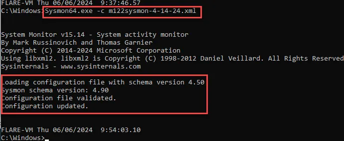

# Intro to Wazuh Part 3: Sysmon Tuning, Wazuh Custom Rules, and APT Simulator

## Summary

Today we will further refine Wazuh by tuning Sysmon and installing custom rules. Lastly, we will install APT Simulator so that you can simulate attacks on your Windows VM and investigate them with Wazuh. 

## Sysmon Review

Although we have used Sysmon logs in previous exercises, we have not covered it in much detail. Sysmon, short for System Monitor, is a powerful tool developed by Microsoft's Sysinternals team for Windows systems. It is designed to monitor and log system activity, providing detailed information about process creations, network connections, file modifications, and more. Sysmon is particularly useful for security monitoring, allowing administrators to detect suspicious or unauthorized activities on their systems.

In previous walkthroughs we used a PowerShell script to download and install Sysmon. The purpose of that script was to easily install Sysmon and enable it so that it would begin collecting logs that were used during exercises with Splunk, Elastic, and Wazuh. Today we will cover how to tune the Sysmon configuration to our individual lab environments. 

### Configuring Sysmon

Sysmon uses an XML configuration file (`sysmonconfig.xml`) to specify which events to log and how to handle them. Here’s a basic example of a Sysmon configuration file:


- **ProcessCreate**: Logs process creations that end with `.exe`.
- **NetworkConnect**: Logs network connections to ports 80 (HTTP) and 443 (HTTPS).
- **ImageLoad**: Logs image loads that are not signed.

### Explanation of Configuration:

- **Sysmon**: Specifies the Sysmon schema version.
- **EventFiltering**: Contains one or more rule groups.
- **RuleGroup**: Defines a group of rules that are evaluated with a logical OR.
- **ProcessCreate**: Logs details about process creations.
- **NetworkConnect**: Logs details about network connections.
- **ImageLoad**: Logs details about image loads.

Modify the XML file based on your specific monitoring requirements. After configuring `sysmonconfig.xml`, save it in the same directory where `sysmon.exe` resides and install Sysmon using the command below: 

```jsx
sysmon.exe -accepteula -i <name of sysmon confiuration file>.xml
```

If you have already installed Sysmon and are just changing the configuration file, use the command below:

```jsx
sysmon.exe -c <name of sysmon confiuration file>.xml
```

Sysmon will then start monitoring system activity according to your configuration, and you can analyze its logs using tools like Event Viewer or SIEM (Security Information and Event Management) solutions for further security analysis and monitoring.

## Sysmon Modular Configuration

"Sysmon Modular" refers to a configuration framework developed by Olaf Hartong, a well-known cybersecurity expert, that enhances the capabilities and manageability of Microsoft Sysmon (System Monitor). Sysmon Modular extends the basic Sysmon configuration by providing a structured and modular approach to defining what activities and events should be monitored on Windows systems. This framework is particularly useful for security professionals and administrators who require fine-grained control over system monitoring and threat detection.

### Key Features of Sysmon Modular

1. **Modular Configuration**: Sysmon Modular organizes the Sysmon configuration file (`sysmonconfig.xml`) into reusable modules. Each module focuses on specific types of events or behaviors that need monitoring. This modular approach makes it easier to manage and update the configuration based on evolving security needs.
2. **Predefined Templates**: Sysmon Modular includes predefined templates for different use cases, such as monitoring malware behavior, tracking command-line activity, detecting lateral movement, etc. These templates serve as starting points that can be customized according to specific organizational requirements.
3. **Granular Event Filtering**: The framework allows for granular control over event filtering and logging. Administrators can specify which events (process creations, network connections, file modifications, etc.) to include or exclude based on conditions like image name, process ID, destination port, etc.
4. **Centralized Configuration**: Sysmon Modular supports centralized configuration management, where configurations can be standardized across multiple systems. This centralized approach facilitates consistency and ensures that all monitored systems adhere to the same security policies.
5. **Community Contributions**: Being an open framework, Sysmon Modular encourages community contributions and sharing of best practices. Security professionals can benefit from shared configurations and insights into emerging threats and attack techniques.

### Advantages of Sysmon Modular

- **Flexibility**: Allows customization and extension of Sysmon's capabilities without needing to start from scratch.
- **Efficiency**: Reduces configuration time by leveraging predefined modules and templates.
- **Scalability**: Scales easily across multiple systems and environments with consistent monitoring policies.
- **Community Support**: Benefits from contributions and updates from a community of cybersecurity professionals.

Overall, Sysmon Modular enhances Sysmon's utility as a powerful monitoring tool for Windows systems, offering a structured and adaptable approach to security monitoring and threat detection. It reflects best practices in system monitoring and contributes to a proactive security posture against various cyber threats.

You can learn more on the Sysmon Modular Github page at the link below:

https://github.com/olafhartong/sysmon-modular

Below is a screenshot of the Sysmon Modular Github page.


As seen above it includes exclusions to add for each Sysmon Event ID. For example, below are the exclusions for Event ID 1 Process Creation.


The Github page also includes templates of pre-generated configuration files to act as a baseline.


The first exercise we will do is change our Sysmon configuration file to the sysmonconfig-with-filedelete.xml configuration.


The easiest way to get the file is to open it, select all, copy it, and paste into a notepad++ document and save it with an .xml file extension.

Once it is saved, copy and paste the document into the same directory as Sysmon. In this case it is the Windows directory.


Then run the following command:

```jsx
Sysmon.exe -c sysmonconfig-with-filedelete.xml
```


The pre-configured configuration file is a starting point. You should tune it to your environment.

## Sysmon Tuning

If you receive a large amount of excess event logging you can tune your Sysmon configuration to exclude the uneeded events by editing the Sysmon configuration file.


Open one of the logging events and determine the EventID and which field is appropriate to base your exclusion on. As seen below, the EventID is 11 (File Creation) and the image is cleanmgr.exe. 


Cleanmgr.exe, or cleanup manager, is a Microsoft tool that automatically removes unnecessary files from a computer's hard drive to free up disk space. It searches and analyzes the hard drive for files that are no longer needed and then removes them. It triggers multiple false positives. 

As seen below, we can edit the Sysmon configuration file by adding the image name to the exclusion section under EventID 11.


After editing the file save it under a different name and restart Sysmon adding the “-c” switch to change the configuration.



## PSGumshoe

The PowerShell module **PSGumshoe** is a community-driven tool designed to aid in threat hunting and security monitoring within Windows environments. PSGumshoe provides PowerShell functions and cmdlets that leverage Microsoft Sysmon (System Monitor) and other sources to collect and analyze security-related data. We will use it to help use tune Sysmon. For more information you can visit the Github page at the link below.

https://github.com/PSGumshoe/PSGumshoe

You can install PSGumshoe using the command below.

```jsx
Install-Module psgumshoe -force
```


To see all the possible commands in the PSGumshoe module enter the command below.

```jsx
Get-Command -Module PSGumshoe
```


By using the scripts built into the PSGumshoe module we can view specific events being logged by PowerShell. As seen below the Get-SysmonProcessCreateEvent command returns all the Event ID 1 events logged by Sysmon.

```jsx
Get-SysmonProcessCreateEvent
```


We can filter this by specific fields. In the example below, we are filtering it by unique values in the Image field.

```jsx
Get-SysmonProcessCreateEvent | select Image -Unique
```


By piping the results to the ConvertTo-SysmonRule script as seen below, we can use this to edit our sysmon configuration.

```jsx
Get-SysmonProcessCreateEvent | select Image -Unique | ConvertTo-SysmonRule
```


To make it easier to copy and paste the rule into our Sysmon config we can pipe the output to a .txt file and then copy and paste it into our config file. 

```jsx
Get-SysmonProcessCreateEvent | select image -Unique | ConvertTo-SysmonRule | Out-File ./EventID1_Process_Create.txt
```

 


## Sysmon Events

Below are the Sysmon events and ID codes. We can use those when we tune Sysmon and when we conduct threat hunting and investigations.

**Event ID 1: Process creation**

The process creation event provides extended information about a newly created process. The full command line provides context on the process execution. The `ProcessGUID` field is a unique value for this process across a domain to make event correlation easier. The hash is a full hash of the file with the algorithms in the `HashType` field.

**Event ID 2: A process changed a file creation time**

The change file creation time event is registered when a file creation time is explicitly modified by a process. This event helps tracking the real creation time of a file. Attackers may change the file creation time of a backdoor to make it look like it was installed with the operating system. Note that many processes legitimately change the creation time of a file; it does not necessarily indicate malicious activity.

**Event ID 3: Network connection**

The network connection event logs TCP/UDP connections on the machine. It is disabled by default. Each connection is linked to a process through the `ProcessId` and `ProcessGuid` fields. The event also contains the source and destination host names IP addresses, port numbers and IPv6 status.

**Event ID 4: Sysmon service state changed**

The service state change event reports the state of the Sysmon service (started or stopped).

**Event ID 5: Process terminated**

The process terminate event reports when a process terminates. It provides the `UtcTime`, `ProcessGuid` and `ProcessId` of the process.

**Event ID 6: Driver loaded**

The driver loaded events provides information about a driver being loaded on the system. The configured hashes are provided as well as signature information. The signature is created asynchronously for performance reasons and indicates if the file was removed after loading.

**Event ID 7: Image loaded**

The image loaded event logs when a module is loaded in a specific process. This event is disabled by default and needs to be configured with the "`–l`" option. It indicates the process in which the module is loaded, hashes and signature information. The signature is created asynchronously for performance reasons and indicates if the file was removed after loading. This event should be configured carefully, as monitoring all image load events will generate a significant amount of logging.

**Event ID 8: CreateRemoteThread**

The `CreateRemoteThread` event detects when a process creates a thread in another process. This technique is used by malware to inject code and hide in other processes. The event indicates the source and target process. It gives information on the code that will be run in the new thread: `StartAddress`, `StartModule` and `StartFunction`. Note that `StartModule` and `StartFunction` fields are inferred, they might be empty if the starting address is outside loaded modules or known exported functions.

**Event ID 9: RawAccessRead**

The `RawAccessRead` event detects when a process conducts reading operations from the drive using the `\\.\` denotation. This technique is often used by malware for data exfiltration of files that are locked for reading, as well as to avoid file access auditing tools. The event indicates the source process and target device.

**Event ID 10: ProcessAccess**

The process accessed event reports when a process opens another process, an operation that’s often followed by information queries or reading and writing the address space of the target process. This enables detection of hacking tools that read the memory contents of processes like Local Security Authority (Lsass.exe) in order to steal credentials for use in Pass-the-Hash attacks. Enabling it can generate significant amounts of logging if there are diagnostic utilities active that repeatedly open processes to query their state, so it generally should only be done so with filters that remove expected accesses.

**Event ID 11: FileCreate**

File create operations are logged when a file is created or overwritten. This event is useful for monitoring autostart locations, like the Startup folder, as well as temporary and download directories, which are common places malware drops during initial infection.

**Event ID 12: RegistryEvent (Object create and delete)**

Registry key and value create and delete operations map to this event type, which can be useful for monitoring for changes to Registry autostart locations, or specific malware registry modifications.

Sysmon uses abbreviated versions of Registry root key names, with the following mappings:

**Expand table**

| Key name | Abbreviation |
| --- | --- |
| `HKEY_LOCAL_MACHINE` | `HKLM` |
| `HKEY_USERS` | `HKU` |
| `HKEY_LOCAL_MACHINE\System\ControlSet00x` | `HKLM\System\CurrentControlSet` |
| `HKEY_LOCAL_MACHINE\Classes` | `HKCR` |

**Event ID 13: RegistryEvent (Value Set)**

This Registry event type identifies Registry value modifications. The event records the value written for Registry values of type `DWORD` and `QWORD`.

**Event ID 14: RegistryEvent (Key and Value Rename)**

Registry key and value rename operations map to this event type, recording the new name of the key or value that was renamed.

**Event ID 15: FileCreateStreamHash**

This event logs when a named file stream is created, and it generates events that log the hash of the contents of the file to which the stream is assigned (the unnamed stream), as well as the contents of the named stream. There are malware variants that drop their executables or configuration settings via browser downloads, and this event is aimed at capturing that based on the browser attaching a `Zone.Identifier` "mark of the web" stream.

**Event ID 16: ServiceConfigurationChange**

This event logs changes in the Sysmon configuration - for example when the filtering rules are updated.

**Event ID 17: PipeEvent (Pipe Created)**

This event generates when a named pipe is created. Malware often uses named pipes for interprocess communication.

**Event ID 18: PipeEvent (Pipe Connected)**

This event logs when a named pipe connection is made between a client and a server.

**Event ID 19: WmiEvent (WmiEventFilter activity detected)**

When a WMI event filter is registered, which is a method used by malware to execute, this event logs the WMI namespace, filter name and filter expression.

**Event ID 20: WmiEvent (WmiEventConsumer activity detected)**

This event logs the registration of WMI consumers, recording the consumer name, log, and destination.

**Event ID 21: WmiEvent (WmiEventConsumerToFilter activity detected)**

When a consumer binds to a filter, this event logs the consumer name and filter path.

**Event ID 22: DNSEvent (DNS query)**

This event is generated when a process executes a DNS query, whether the result is successful or fails, cached or not. The telemetry for this event was added for Windows 8.1 so it is not available on Windows 7 and earlier.

**Event ID 23: FileDelete (File Delete archived)**

A file was deleted. Additionally to logging the event, the deleted file is also saved in the `ArchiveDirectory` (which is `C:\Sysmon` by default). Under normal operating conditions this directory might grow to an unreasonable size - see event ID 26: `FileDeleteDetected` for similar behavior but without saving the deleted files.

**Event ID 24: ClipboardChange (New content in the clipboard)**

This event is generated when the system clipboard contents change.

**Event ID 25: ProcessTampering (Process image change)**

This event is generated when process hiding techniques such as "hollow" or "herpaderp" are being detected.

**Event ID 26: FileDeleteDetected (File Delete logged)**

A file was deleted.

**Event ID 27: FileBlockExecutable**

This event is generated when Sysmon detects and blocks the creation of executable files (PE format).

**Event ID 28: FileBlockShredding**

This event is generated when Sysmon detects and blocks file shredding from tools such as [SDelete](https://learn.microsoft.com/en-us/sysinternals/downloads/sdelete).

**Event ID 29: FileExecutableDetected**

This event is generated when Sysmon detects the creation of a new executable file (PE format).

## Sysmon configuration with PSGumshoe

To tune the sysmon configuration you can start a new system and after you install Sysmon, let it run for an hour or so. Then review Event Viewer or your SIEM (Wazuh in this case). If you see multiple events that are basically noise, you can use PSGumshoe to help filter those out.

Event Code 1 Process Create

```jsx
Get-SysmonProcessCreateEvent | select image -Unique | ConvertTo-SysmonRule | Out-File ./EventID1_Process_Create.txt
```


We can change the sysmon configuration files to exclude the outlined images above.


Event Code 3 Network Connect

```jsx
Get-SysmonNetworkConnect | select image -Unique | ConvertTo-SysmonRule | Out-File ./EventID3_Network_Connect.txt
```


We can change the sysmon configuration files to exclude the outlined images above.


Event Code 11 File Create

```jsx
Get-SysmonFileCreateEvent | select image -Unique | ConvertTo-SysmonRule | Out-File ./EventID11_File_Create.txt
```


We can change the sysmon configuration files to exclude the outlined images above.


Event Code 13 Registry Event (Value Set) 

```jsx
Get-SysmonRegistrySetValue | select image -Unique | ConvertTo-SysmonRule | Out-File ./EventID13_Registry_Value.txt
```


We can change the sysmon configuration files to exclude the outlined images above.


Event Code 23  File Delete Detected

```jsx
Get-SysmonFileDeleteDetectedEvent | select image -Unique | ConvertTo-SysmonRule | Out-File ./EventID23_File_Delete.txt
```


We can change the sysmon configuration files to exclude the outlined image above.


We can paste the updated configuration file in the Windows directory and change the configuration file used by Sysmon with the following command.

```jsx
Sysmon.exe -c m122sysmodular.xml
```


Below is the Security Events Dashboard for the 24 hours before Sysmon configuration update.


As seen below, the 12 hours after the update had a drop of events.


## Importing Custom Rules in Wazuh

Custom rules extend the capabilities of the Wazuh. Wazuh uses a rules-based engine to analyze logs, events, and data from various sources (such as logs from operating systems, applications, and network devices) to detect security incidents, suspicious activities, or policy violations. While Wazuh comes with a comprehensive set of pre-defined rules out of the box, custom rules allow organizations to tailor their monitoring and detection strategies to specific needs, threats, or compliance requirements that may not be covered by the default rule set.

The custom rules provided by SOCFortress are designed to extend Wazuh's capabilities by addressing specific security threats or compliance requirements that may not be covered by default Wazuh rules. You can learn more about SOCFortress and their custom rule set at their Github page linked below.

https://github.com/socfortress/Wazuh-Rules

To import the SOCFortress rules: 

1. SSH to your Wazuh Server.


1. Run the curl command below.

```powershell
curl -so ~/wazuh_socfortress_rules.sh https://raw.githubusercontent.com/socfortress/Wazuh-Rules/main/wazuh_socfortress_rules.sh && bash ~/wazuh_socfortress_rules.sh
```

1. Restart Wazuh-manager

```jsx
sudo systemctl restart wazuh-manager
```

1. The rules are automatically imported and enabled.

## Set up Exclusions in Windows Defender on Your Windows VM

During testing we may need to turn Windows Defender on and off, depending on what we are testing. If we want to ensure that Windows Defender will not quarantine any of our test scripts, we can set up an exclusion for a directory to keep our test scripts.


Select Folder


Select the folder you want to be excluded from Defender.


## APT Simulator

We will use an attack emulator, called APT Simulator, to practice investigating and threat hunting with Wazuh.  APT Simulator, a Windows Batch script, employs a range of tools and output files to simulate a compromised system. Unlike other adversary simulation tools, APT Simulator prioritizes simplicity. No web server, database, or agents need to be executed on a set of virtual machines. Simply download the archive by using the PowerShell script below, extract it, and run the included Batch file as Administrator on your Windows victim VM. 

```powershell
Invoke-WebRequest -Uri https://github.com/NextronSystems/APTSimulator/releases/download/v0.9.4/APTSimulator_pw_apt.zip -OutFile C:/Users/m122/Documents/malz/APTSimulator.zip
```

The focus of APT Simulator is to simulate adversary activity, not malware.

1. Extract the package on yor Windows victim VM (Password: apt)


1. Take a snapshot of the VM before executing APTSimulator.
2. Start a cmd.exe as Administrator
3. Navigate to the extracted program folder and run APTSimulator.bat


1. You will receive the warning shown below. Enter “Y”.


You will then be presented with the menu shown below.


For walkthrough purposes, we will run menu item “#1 Collection” and demonstrate how we will hunt for it in Wazuh. 

Ensure Microsoft Defender Real-Time Protection is disabled.


  Run menu item #1 (Collection)


No alerts level 12 or higher alerts were created after running menu item 1.


However, several lower alerts appear to be related.


## Homework

Run your choice of APT Simulator attacks and investigate using Wazuh.