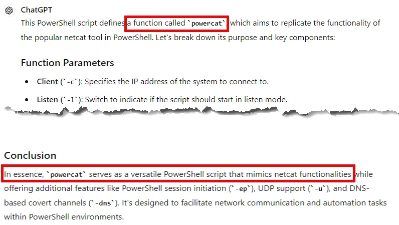

# Wazuh CTF Walkthrough

# **Introduction**

This CTF is designed to be done in your own virtual environment consisting of a Windows VM with a Wazuh agent installed and a Wazuh server VM. The TryHackMe room that is linked below will be used as the scoring server. The event data will be created using APT Simulator. You should use Wazuh to answer each question.

[](https://tryhackme.com/jr/wazuhctf)

# **APT Simulator**

We will use an attack emulator, called APT Simulator, to create the data for the Wazuh CTF. APT Simulator, a Windows Batch script, employs a range of tools and output files to simulate a compromised system. Unlike other adversary simulation tools, APT Simulator prioritizes simplicity. No web server, database, or agents need to be executed on a set of virtual machines. Simply download the archive by using the PowerShell script below, extract it, and run the included Batch file as Administrator on your Windows victim VM.

```jsx
Invoke-WebRequest -Uri https://github.com/NextronSystems/APTSimulator/releases/download/v0.9.4/APTSimulator_pw_apt.zip -OutFile C:/Users/m122/Documents/malz/APTSimulator.zip
```

The focus of APT Simulator is to simulate adversary activity, not malware.

1) Take a snapshot of the VM before executing APTSimulator.

2) Extract the package on yor Windows victim VM (Password: apt)

[](Screenshots/03-Wazuh/4-WazuhCTF/image1.png)

3. Start cmd.exe as Administrator

4. Navigate to the extracted program folder and run APTSimulator.bat

[](Screenshots/03-Wazuh/4-WazuhCTF/image2.png)

5. You will receive the warning shown below. Enter “Y”.

[](Screenshots/03-Wazuh/4-WazuhCTF/image3.png)

6 .You will then be presented with the menu shown below.

[](Screenshots/03-Wazuh/4-WazuhCTF/image4.png)

7. Select "0" "RUN EVERY TEST".

After APTSimulator completes, you can go to the Wazuh dashboard and answer the CTF questions.

Once logged in, go the hamburger menu and select Discover.


Set the time picker for the appropriate time.


Ensure that wazuh-archives is selected.


You should be able to answer all the questions in the CTF. Use the hints if needed. For example, the hint for question #1 is the search query you should use.

 


**Question 1: What "Remote System Discovery" technique process was executed the most?**

Use the query given in the hint shown above.

Then look at the data.win.eventdata.image field. The reason we are looking at the “Image” field is because that is the executable that created the process. Just clicking the field gives you the top 5 values. So you could answer the question just by clicking the field.


Additionally, you can create a visualization by selecting from the hamburger menu.


Then select “Create new visualization”.


Then choose “Data Table”.


Choose wazuh-archives-* as the data source.


Run the same query given in the hint with the same time window.

```jsx
data.win.system.eventID:1 AND "Remote System Discovery”
```

Select Add under the Buckets menu.


Select “Split Rows”


From the aggregation drop-down select “Terms”


Under field select data.win.eventdata.image and click Update.


This will give you the total number of each image that created an EventID 1 under the MITRE ATT&CK Technique “Remote System Discovery”.


**Question 2. What other "Remote System Discovery" technique processes were executed?**

Use the same steps as question 1, listed above.

**Question 3. What was the parent image for both Remote System Discovery techniques?**

Use the same query: 

```jsx
data.win.system.eventID:1 AND "Remote System Discovery”
```

Look at the data.win.eventdata.parentImage field. To quickly find the field search for parent.


You can also do a visualization.


**Question 4 DNS queries were run for 3 domains (Not google or github). List the them in alphabetical order.**

Run the query:

```jsx
data.win.system.eventID:22
```

Then look at the data.win.eventdata.queryName field. This field includes the domain of the DNS query.


Alternatively, you can do a visualization.


**Question 5. Has the first one domain ever been reported as being related to malicious activity? (Y/N)**

Look up the domain freenow[.]chickenkiller[.]com in VirusTotal.


10 out of 93 AV vendors report this domain as malicious.

**Question 6. Has the second domain ever been reported as being related to malicious activity? (Y/N)**

Look up the domain msupdater[.]com in VirusTotal


5 out of 93 AV vendors report this domain as malicious.

**Question 7. Has the third domain ever been reported as being related to malicious activity? (Y/N)**

Look up the domain twitterdocs[.]com in VirusTotal.


5 out of 93 AV vendors report this domain as malicious.

**Question 8. What PowerShell files (.ps1) were executed from the TMP directory? (List in alphabetical order)**

Run the query:

```jsx
data.win.system.eventID:4104 AND data.win.eventdata.path:*TMP*
```

Then examine the data.win.eventdata.path field.


You can also choose to display the path field.


**Question 9. What function is nc.ps1 defining?**

Run the query 

```jsx
data.win.system.eventID:4104 AND data.win.eventdata.path:nc.ps1 
```

Copy the script block text from the first event in chronological order and drop it into Chat GPT (or AI of choice) and ask what it is doing.




**Question 10. Similar to netcat, nc.ps1 gives the attacker a reverse ____to get access of the system? Fill in the blank.**

From previous labs we have used netcat to gain a reverse **shell.**

**Question 11. What image (.exe file) was involved in the "Maquerading" technique** 

Use the query:

```jsx
data.win.system.eventID:1 AND "Masquerading”
```

View the data.win.eventdata.image field.


**Question 11. How many scheduled tasks were created?**

Use the query below to see how many times schtasks.exe was executed to create a scheduled task.

```jsx
data.win.eventdata.originalFileName:schtasks.exe
```


**Question 12. What well known password stealer was installed as a scheduled task?**

Using the same query as question 12, look at the data.win.eventdata.commandLine field.


sekurlsa is a mimikatz module. Below is the first result of a Google search for it.


**Question 13. What is the output file of the password stealer identified in the previous question?**

Once again, look at the commandline field. We can see that the output of mimikatz was written to o.txt in the TMP directory.


**Question 14. What is the parent Image of both scheduled tasks?**

From the original query in question 11, look at the data.win.eventdata.parentImage field.

```jsx
data.win.eventdata.originalFileName:schtasks.exe
```


**Question 15. What images potentially used DLL Side-Loading technique when loaded?**

Run the query:

```jsx
data.win.system.eventID:7 and "DLL Side-Loading”
```

Look at the data.win.eventdata.image fielden the field


Select the field to see the entire path to the images.


You could also create a visualization.

